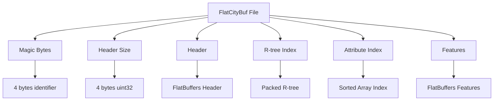
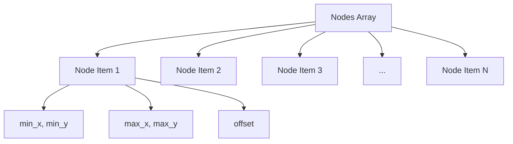
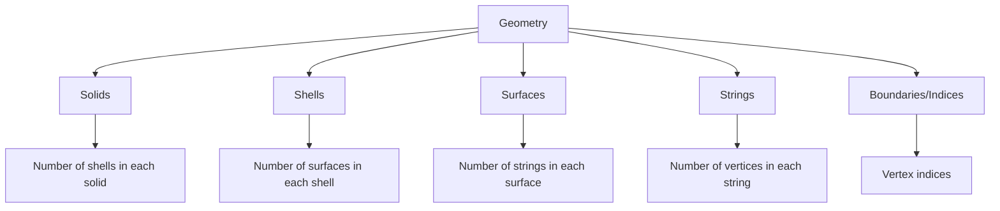
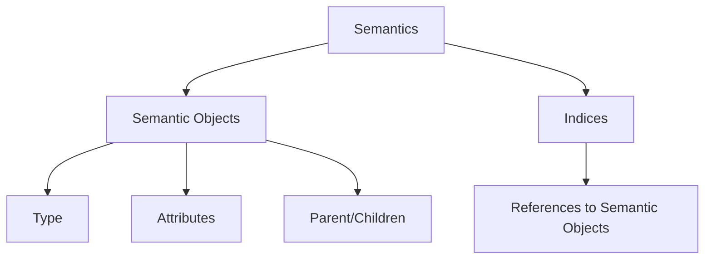
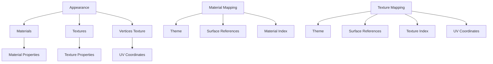
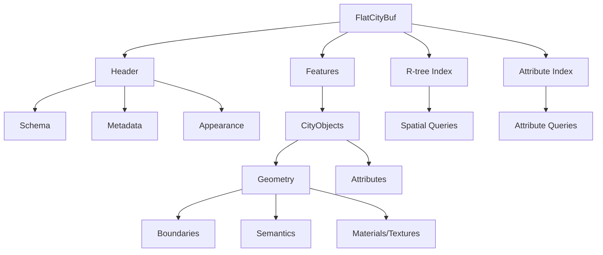

# flatcitybuf specification

## overview of the file format

flatcitybuf is a cloud-optimized binary format for storing and retrieving 3d city models based on the cityjson standard. it combines the semantic richness of cityjson with the performance benefits of flatbuffers binary serialization and spatial indexing techniques.

the format is designed to address several limitations of existing cityjson formats:

- **performance**: traditional json-based formats require full parsing before data access, while flatcitybuf enables zero-copy access to specific city objects.
- **cloud optimization**: supports http range requests for partial data retrieval, reducing bandwidth usage and improving load times.
- **spatial indexing**: implements a packed r-tree for efficient spatial queries.
- **attribute indexing**: uses binary search trees for fast attribute-based filtering.
- **size efficiency**: binary encoding reduces file sizes by 50-70% compared to text-based formats.

the format maintains backward compatibility with cityjson 2.0 while significantly improving query performance (10-20× faster) and storage efficiency.

## flatbuffers schema explanation

flatcitybuf uses two primary schema files to define its structure:

### header.fbs

the `header.fbs` schema defines the metadata and indexing structures of a flatcitybuf file:

```flatbuffers
table Header {
  transform: Transform;                     // Transformation vectors
  appearance: Appearance;                   // Appearance object for materials and textures
  columns: [Column];                        // Attribute columns schema
  features_count: ulong;                    // Number of features in the dataset
  index_node_size: ushort = 16;             // Index node size for R-tree
  attribute_index: [AttributeIndex];        // Attribute indexing information
  geographical_extent: GeographicalExtent;  // Bounds
  reference_system: ReferenceSystem;        // Spatial Reference System
  // ... additional metadata fields ...
  version: string (required);               // CityJSON version
}
```

key components include:

- **transform**: stores scale and translation vectors for vertex coordinates
- **appearance**: contains materials and textures information
- **columns**: schema for attribute data
- **attribute_index**: indexing for fast attribute queries
- **geographical_extent**: bounding box of the dataset
- **reference_system**: coordinate reference system information

### feature.fbs

the `feature.fbs` schema defines the structure of city objects and their geometries:

```flatbuffers
table CityFeature {
  id: string (key, required);
  objects: [CityObject];
  vertices: [Vertex];
  appearance: Appearance;
}

table CityObject {
  type: CityObjectType;
  id: string (key, required);
  geographical_extent: GeographicalExtent;
  geometry: [Geometry];
  attributes: [ubyte];
  columns: [Column];
  children: [string];
  children_roles: [string];
  parents: [string];
}
```

key components include:

- **cityfeature**: the root object containing city objects and shared vertices
- **cityobject**: individual 3d features with type, geometry, and attributes
- **geometry**: complex structure for 3d geometries with boundaries and semantics
- **semanticobject**: semantic classification of geometry parts

### Geometry Template and Instance Encoding

FlatCityBuf supports CityJSON's Geometry Templates for efficient representation of repeated geometries.

**Template Definition (in `header.fbs`)**

Geometry templates are defined globally within the `Header` table:

```flatbuffers
// Within header.fbs, inside the Header table:
table Header {
  // ... other fields ...
  templates: [Geometry];             // Array of template Geometry definitions
  templates_verteces: [DoubleVertex]; // Array of all vertices used by templates (f64 precision)
  // ... other fields ...
}

struct DoubleVertex {
  x: double;
  y: double;
  z: double;
}
```

- `templates`: An array of standard `Geometry` tables (defined in `geometry.fbs`), each representing a reusable geometry shape. The encoding of boundaries, semantics, etc., within these template geometries follows the standard `Geometry` encoding rules.
- `templates_verteces`: A single flat array containing all vertices for *all* templates. Vertices are stored as `DoubleVertex` (using `f64`) to maintain precision, as templates are often defined in a local coordinate system. The indices used within a template's `boundaries` refer to its specific block of vertices within this global array.

**Instance Definition (in `feature.fbs` via `geometry.fbs`)**

Individual CityObjects use `GeometryInstance` tables to reference and place templates:

```flatbuffers
// Within feature.fbs, inside the CityObject table:
table CityObject {
  // ... other fields ...
  geometry_instances: [GeometryInstance]; // Array of instances using templates
  // ... other fields ...
}

// Defined in geometry.fbs:
table GeometryInstance {
  transformation: TransformationMatrix; // 4x4 transformation matrix
  template: uint;                     // 0-based index into Header.templates array
  boundaries: [uint];                 // MUST contain exactly one index into the *feature's* vertices array (the reference point)
}

struct TransformationMatrix {
  m00:double; m01:double; m02:double; m03:double; // Row 1
  m10:double; m11:double; m12:double; m13:double; // Row 2
  m20:double; m21:double; m22:double; m23:double; // Row 3
  m30:double; m31:double; m32:double; m33:double; // Row 4
}
```

- `geometry_instances`: An array within a `CityObject` holding references to templates.
- `GeometryInstance`:
  - `template`: The index of the template geometry in the `Header.templates` array.
  - `boundaries`: Contains **exactly one** `uint` index. This index refers to a vertex within the *containing `CityFeature`'s* `vertices` array (which uses `int` coordinates). This vertex serves as the reference point for the instance.
  - `transformation`: A `TransformationMatrix` struct defining the 4x4 matrix (rotation, translation, scaling) applied to the template geometry relative to the reference point. The 16 `f64` values are stored row-major.

This separation allows defining complex shapes once in the header and instantiating them multiple times within features using only an index, a reference point index, and a transformation matrix.

### design rationale

the schema design follows several key principles:

1. **flatbuffers efficiency**: uses flatbuffers' zero-copy access for fast data retrieval
2. **hierarchical structure**: maintains cityjson's hierarchical object model
3. **shared vertices**: uses indexed vertices to reduce redundancy
4. **semantic preservation**: maintains rich semantic information from cityjson
5. **extensibility**: allows for future extensions while maintaining backward compatibility

## file storage overview

a flatcitybuf file consists of the following sections:



1. **magic bytes**: 4 bytes identifier for the file format ('fcb\\0')
2. **header size**: 4 bytes uint32 indicating the size of the header in bytes
3. **header**: flatbuffers-encoded header containing metadata, schema, and index information
4. **r-tree index**: packed r-tree for spatial indexing
5. **attribute index**: sorted array-based index for attribute queries
6. **features**: the actual city objects encoded as flatbuffers

each section is aligned to facilitate efficient http range requests, allowing clients to fetch only the parts they need.

## rtree indexing

flatcitybuf implements a packed r-tree for spatial indexing, based on the hilbert r-tree algorithm:

### encoding structure

the r-tree is stored as a flat array of node items:



each node entry contains:

- **min_x, min_y**: minimum coordinates of 2d bounding box
- **max_x, max_y**: maximum coordinates of 2d bounding box
- **offset**: byte offset to the feature in the features section

note that the packed r-tree implementation is 2d only, using x and y coordinates. the z dimension is not included in the spatial indexing, though it remains part of the feature data.

the node size (number of entries per node) is stored in the header as `index_node_size`, and the total number of nodes is calculated based on the number of features and the node size.

### feature size determination

the size of each feature is not stored explicitly in the r-tree. instead, it is determined implicitly:

1. for non-leaf nodes: the size is not needed as they only point to other nodes
2. for leaf nodes: the size of a feature is determined by the difference between its offset and the offset of the next feature
3. for the last feature: the size extends to the end of the file

this approach saves space in the index structure while still allowing efficient access to features.

### hilbert ordering

features are ordered using a hilbert space-filling curve to improve spatial locality:

1. compute the hilbert value for each feature's centroid (using only x,y coordinates)
2. sort features by their hilbert values
3. build the r-tree bottom-up from the sorted features

this approach ensures that spatially close objects are also close in the file, improving cache efficiency and range request performance.

### query algorithm

to query the r-tree:

1. start at the root node
2. for each entry in the node, check if the query intersects the 2d bounding box
3. if it's a leaf node, return the feature offsets
4. if it's an internal node, recursively query the child nodes

for 3d filtering, additional z-coordinate filtering must be performed after retrieving the features that match the 2d query.

## attribute indexing

flatcitybuf implements a sorted array-based index for efficient attribute queries:

### encoding structure

the attribute index is stored as a sorted array of key-value entries:

```
┌─────────────────┐
│ entry count     │ 8 bytes, number of entries
├─────────────────┤
│ key-value entry │ variable length
├─────────────────┤
│ key-value entry │ variable length
├─────────────────┤
│ ...             │
└─────────────────┘
```

each key-value entry contains:

- **key length**: 8 bytes, length of the key in bytes
- **key**: variable length, serialized key value
- **offsets count**: 8 bytes, number of offsets
- **offsets**: array of 8-byte offsets pointing to features

### serialization by type

different attribute types are serialized using the `byteserializable` trait:

- **integers**: stored in little-endian format (i8, i16, i32, i64, u8, u16, u32, u64)
- **floating point**: wrapped in `orderedfloat` to handle nan values properly
- **strings**: utf-8 encoded byte arrays
- **booleans**: single byte (0 for false, 1 for true)
- **datetimes**: 12 bytes (8 for timestamp, 4 for nanoseconds)
- **dates**: 12 bytes (4 for year, 4 for month, 4 for day)

### query algorithm

the attribute index supports various query operations:

- **exact match**: binary search to find the exact key
- **range queries**: find all keys within a specified range
- **comparison operators**: =, !=, >, >=, <, <=
- **compound queries**: multiple conditions combined with logical and

the `multiindex` structure maps field names to their corresponding indices, allowing for heterogeneous index types.

### http optimization

currently, the attribute index can filter results when used with http range requests, but has limitations:

1. **current implementation**: each matching feature is fetched individually, which can lead to many small http requests
2. **future work**: batch processing of nearby offsets to reduce the number of http requests
3. **optimization needed**: streaming processing for attribute indices to avoid loading all attributes at once

these optimizations will significantly improve performance for attribute-based queries over http, especially for large datasets with many features.

## boundaries, semantics, and appearances encoding

### boundaries encoding

flatcitybuf uses a hierarchical indexing approach for geometry boundaries, following the dimensional hierarchy of cityjson:



the encoding strategy follows a dimensional hierarchy:

1. **indices/boundaries**: a flattened array of vertex indices
2. **strings**: each element represents the number of vertices in a string, and the array length indicates the total number of strings
3. **surfaces**: each element represents the number of strings in a surface
4. **shells**: each element represents the number of surfaces in a shell
5. **solids**: each element represents the number of shells in a solid

example encoding for a simple triangle:

```
boundaries: [0, 1, 2]  // vertex indices
strings: [3]           // 3 vertices in the string
surfaces: [1]          // 1 string in the surface
```

example encoding for a cube:

```
boundaries: [0, 1, 2, 3, 0, 3, 7, 4, 1, 5, 6, 2, 4, 7, 6, 5, 0, 4, 5, 1, 2, 6, 7, 3]  // vertex indices
strings: [4, 4, 4, 4, 4, 4]  // 6 strings with 4 vertices each
surfaces: [1, 1, 1, 1, 1, 1]  // 6 surfaces with 1 string each
shells: [6]                   // 1 shell with 6 surfaces
solids: [1]                   // 1 solid with 1 shell
```

### semantics encoding

semantic information is stored in a similar hierarchical structure:



each semantic object contains:

- type (e.g., wallsurface, roofsurface)
- attributes (specific to the semantic type)
- parent/children relationships (for hierarchical semantics)

### appearances encoding

appearances (materials and textures) are encoded as follows:



material and texture mappings associate surfaces with specific materials and textures, allowing for detailed visual representation of city objects.

## attributes encoding

attributes in flatcitybuf are encoded as binary data with a schema defined in the header:

### column schema

each attribute has a column definition:

```flatbuffers
table Column {
  index: ushort;                // Column index
  name: string (required);      // Column name
  type: ColumnType;             // Column type
  // ... additional metadata ...
}
```

### binary encoding

attributes are stored as a binary blob with values encoded according to their type:

- **numeric types**: native binary representation
- **string**: length-prefixed utf-8 string
- **boolean**: single byte (0 or 1)
- **json**: length-prefixed json string
- **binary**: length-prefixed binary data

### attribute access

to access an attribute:

1. find the column definition in the header
2. locate the attribute data in the feature's attributes array
3. deserialize according to the column type

## http range requests mechanism

flatcitybuf is designed for efficient access over http using range requests, allowing clients to fetch only the parts of the file they need:

### range request workflow

1. **header retrieval**:
   - client first fetches the magic bytes (4 bytes)
   - then fetches the header size (4 bytes)
   - finally fetches the header (variable size)
   - the client also prefetches a small portion of the r-tree index to optimize subsequent requests

2. **spatial query**:
   - client traverses the r-tree index using range requests
   - for leaf nodes, the client determines feature locations from their offsets
   - feature sizes are determined implicitly by the difference between consecutive offsets
   - for the last feature, the range extends to the end of the file

3. **attribute query**:
   - client traverses the attribute index using range requests
   - retrieves feature offsets for matching attribute values
   - batches feature requests to minimize http overhead

4. **feature retrieval**:
   - client fetches features using their byte ranges
   - features are decoded using flatbuffers zero-copy access
   - geometry and attributes are processed on demand

### optimization techniques

flatcitybuf implements several optimizations for http access:

1. **request batching**:
   - nearby features are grouped into batches to reduce the number of http requests
   - a configurable threshold determines when to combine requests vs. making separate requests
   - this balances between minimizing requests and avoiding excessive data transfer

2. **buffered client**:
   - uses a buffered http client that caches previously fetched data
   - avoids redundant requests for overlapping ranges
   - implements speculative prefetching for anticipated data

3. **minimal header size**:
   - the header is kept small to minimize initial loading time
   - only essential metadata is included in the header

4. **progressive loading**:
   - features are loaded on demand as they're needed
   - supports streaming iteration through features
   - allows applications to start processing data before the entire file is downloaded

## file dependencies graph

the following diagram illustrates the dependencies between components in flatcitybuf:



this structure allows for efficient querying and retrieval of city objects based on both spatial and attribute criteria.
