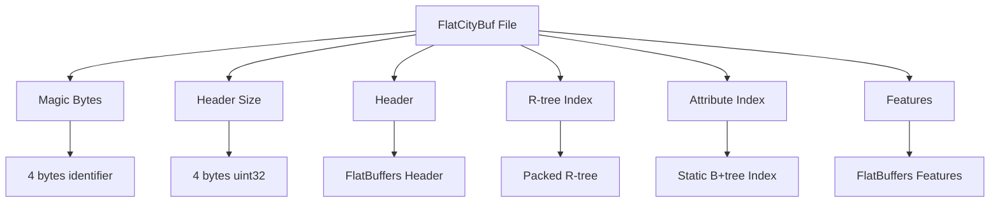
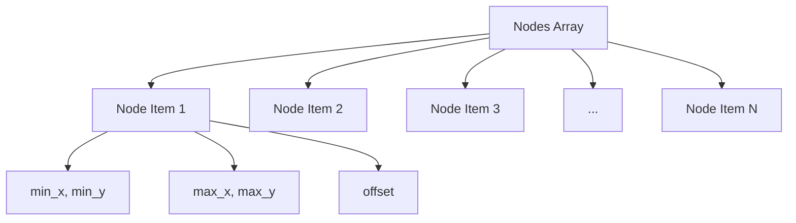
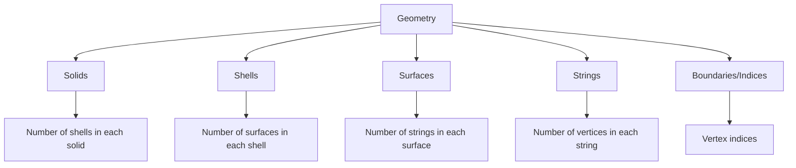
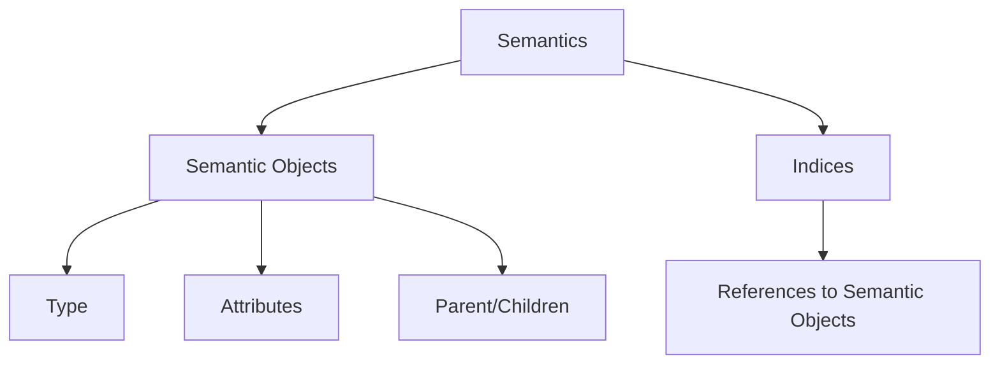
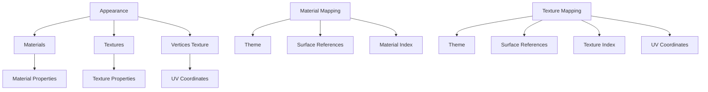
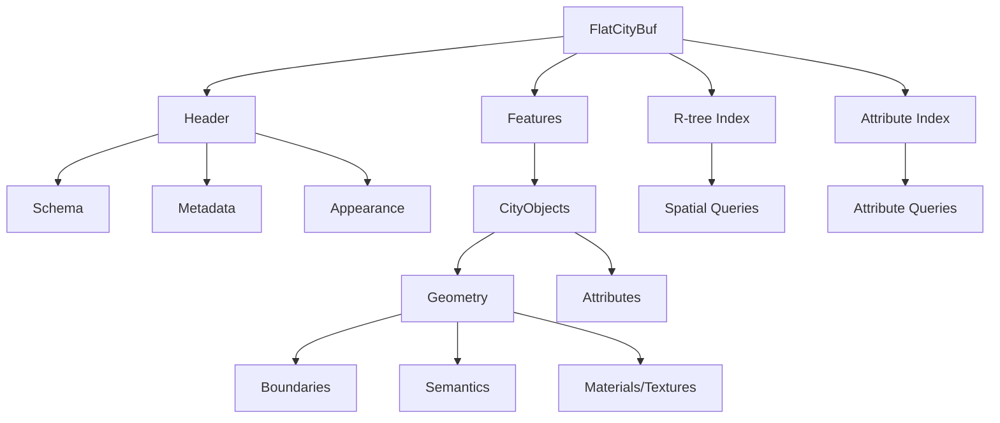

# flatcitybuf specification

## overview of the file format

flatcitybuf is a cloud-optimized binary format for storing and retrieving 3d city models based on the cityjson standard. it combines the semantic richness of cityjson with the performance benefits of flatbuffers binary serialization and spatial indexing techniques.

## flatbuffers schema explanation

flatcitybuf uses two primary schema files to define its structure:

### header.fbs

the `header.fbs` schema defines the metadata and indexing structures of a flatcitybuf file:

```flatbuffers
table Header {
  transform: Transform;                     // Transformation vectors
  appearance: Appearance;                   // Appearance object for materials and textures
  columns: [Column];                        // Attribute columns schema
  features_count: ulong;                    // Number of features in the dataset
  index_node_size: ushort = 16;             // Index node size for R-tree
  attribute_index: [AttributeIndex];        // Attribute indexing information
  geographical_extent: GeographicalExtent;  // Bounds
  reference_system: ReferenceSystem;        // Spatial Reference System
  // ... additional metadata fields ...
  version: string (required);               // CityJSON version
}
```

key components include:

- **transform**: stores scale and translation vectors for vertex coordinates
- **appearance**: contains materials and textures information
- **columns**: schema for attribute data
- **attribute_index**: indexing for fast attribute queries
- **geographical_extent**: bounding box of the dataset
- **reference_system**: coordinate reference system information

### feature.fbs

the `feature.fbs` schema defines the structure of city objects and their geometries:

```flatbuffers
table CityFeature {
  id: string (key, required);
  objects: [CityObject];
  vertices: [Vertex];
  appearance: Appearance;
}

table CityObject {
  type: CityObjectType;
  id: string (key, required);
  geographical_extent: GeographicalExtent;
  geometry: [Geometry];
  attributes: [ubyte];
  columns: [Column];
  children: [string];
  children_roles: [string];
  parents: [string];
}
```

key components include:

- **cityfeature**: the root object containing city objects and shared vertices
- **cityobject**: individual 3d features with type, geometry, and attributes
- **geometry**: complex structure for 3d geometries with boundaries and semantics
- **semanticobject**: semantic classification of geometry parts

### Geometry Template and Instance Encoding

FlatCityBuf supports CityJSON's Geometry Templates for efficient representation of repeated geometries.

**Template Definition (in `header.fbs`)**

Geometry templates are defined globally within the `Header` table:

```flatbuffers
// Within header.fbs, inside the Header table:
table Header {
  // ... other fields ...
  templates: [Geometry];             // Array of template Geometry definitions
  templates_verteces: [DoubleVertex]; // Array of all vertices used by templates (f64 precision)
  // ... other fields ...
}

struct DoubleVertex {
  x: double;
  y: double;
  z: double;
}
```

- `templates`: An array of standard `Geometry` tables (defined in `geometry.fbs`), each representing a reusable geometry shape. The encoding of boundaries, semantics, etc., within these template geometries follows the standard `Geometry` encoding rules.
- `templates_verteces`: A single flat array containing all vertices for _all_ templates. Vertices are stored as `DoubleVertex` (using `f64`) to maintain precision, as templates are often defined in a local coordinate system. The indices used within a template's `boundaries` refer to its specific block of vertices within this global array.

**Instance Definition (in `feature.fbs` via `geometry.fbs`)**

Individual CityObjects use `GeometryInstance` tables to reference and place templates:

```flatbuffers
// Within feature.fbs, inside the CityObject table:
table CityObject {
  // ... other fields ...
  geometry_instances: [GeometryInstance]; // Array of instances using templates
  // ... other fields ...
}

// Defined in geometry.fbs:
table GeometryInstance {
  transformation: TransformationMatrix; // 4x4 transformation matrix
  template: uint;                     // 0-based index into Header.templates array
  boundaries: [uint];                 // MUST contain exactly one index into the *feature's* vertices array (the reference point)
}

struct TransformationMatrix {
  m00:double; m01:double; m02:double; m03:double; // Row 1
  m10:double; m11:double; m12:double; m13:double; // Row 2
  m20:double; m21:double; m22:double; m23:double; // Row 3
  m30:double; m31:double; m32:double; m33:double; // Row 4
}
```

- `geometry_instances`: An array within a `CityObject` holding references to templates.
- `GeometryInstance`:
  - `template`: The index of the template geometry in the `Header.templates` array.
  - `boundaries`: Contains **exactly one** `uint` index. This index refers to a vertex within the _containing `CityFeature`'s_ `vertices` array (which uses `int` coordinates). This vertex serves as the reference point for the instance.
  - `transformation`: A `TransformationMatrix` struct defining the 4x4 matrix (rotation, translation, scaling) applied to the template geometry relative to the reference point. The 16 `f64` values are stored row-major.

This separation allows defining complex shapes once in the header and instantiating them multiple times within features using only an index, a reference point index, and a transformation matrix.

### design rationale

the schema design follows several key principles:

1. **flatbuffers efficiency**: uses flatbuffers' zero-copy access for fast data retrieval
2. **hierarchical structure**: maintains cityjson's hierarchical object model
3. **shared vertices**: uses indexed vertices to reduce redundancy
4. **semantic preservation**: maintains rich semantic information from cityjson

## file storage overview

a flatcitybuf file consists of the following sections:



1. **magic bytes**: 8 bytes identifier for the file format ('fcb\\0\\1\\0\\0\\0\\0\\0')
2. **header size**: 4 bytes uint32 indicating the size of the header in bytes
3. **header**: flatbuffers-encoded header containing metadata, schema, and index information
4. **r-tree index**: packed r-tree for spatial indexing
5. **attribute index**: static b+tree indices for attribute queries
6. **features**: the actual city objects encoded as flatbuffers

each section is aligned to facilitate efficient http range requests, allowing clients to fetch only the parts they need.

## rtree indexing

flatcitybuf implements a packed r-tree for spatial indexing, based on the hilbert r-tree algorithm:

### encoding structure

the r-tree is stored as a flat array of node items:



each node entry contains:

- **min_x, min_y**: minimum coordinates of 2d bounding box
- **max_x, max_y**: maximum coordinates of 2d bounding box
- **offset**: byte offset to the feature in the features section

note that the packed r-tree implementation is 2d only, using x and y coordinates. the z dimension is not included in the spatial indexing, though it remains part of the feature data.

the node size (number of entries per node) is stored in the header as `index_node_size`, and the total number of nodes is calculated based on the number of features and the node size.

### feature size determination

the size of each feature is not stored explicitly in the r-tree. instead, it is determined implicitly:

1. for non-leaf nodes: the size is not needed as they only point to other nodes
2. for leaf nodes: the size of a feature is determined by the difference between its offset and the offset of the next feature
3. for the last feature: the size extends to the end of the file

this approach saves space in the index structure while still allowing efficient access to features.

### hilbert ordering

features are ordered using a hilbert space-filling curve to improve spatial locality:

1. compute the hilbert value for each feature's centroid (using only x,y coordinates)
2. sort features by their hilbert values
3. build the r-tree bottom-up from the sorted features

this approach ensures that spatially close objects are also close in the file, improving cache efficiency and range request performance.

### query algorithm

to query the r-tree:

1. start at the root node
2. for each entry in the node, check if the query intersects the 2d bounding box
3. if it's a leaf node, return the feature offsets
4. if it's an internal node, recursively query the child nodes

for 3d filtering, additional z-coordinate filtering must be performed after retrieving the features that match the 2d query.

## attribute indexing

flatcitybuf implements a b-tree-based index for efficient attribute queries:

### encoding structure

the attribute index is organized as a static/implicit b-tree structure:

Entries in the index are stored and they have fixed size of key + pointer. The byte size of the key is dependent on the attribute type. .e.g. for i32, the key is 4 bytes.

- **internal nodes**: contain keys and pointers to child nodes
- **leaf nodes**: contain keys and offsets to features
- **node structure**: each node includes a entry count, and next-node pointer (for leaf nodes)

this block-based structure aligns with typical page sizes and efficient http range requests, significantly improving i/o performance compared to the previous sorted array approach

### payload section

when duplicate keys exist within an index, a special payload section is used:

- **payload entries**: store arrays of offsets that point to features with the same key
- **payload reference**: leaf nodes store a tagged offset (MSB set to 1) that points to a payload entry
- **offset arrays**: each payload entry contains a count followed by an array of feature offsets

this approach maintains efficient tree traversal for unique keys while properly handling duplicate keys with minimal overhead. the payload section is placed at the end of the index section, after all the node entries.

### payload optimization techniques

two major optimizations improve remote access efficiency for the payload section:

1. **payload prefetching**:

   - a configurable portion of the payload section is prefetched into a cache during the initial query
   - the optimal prefetch size is calculated based on:
     - total tree size (number of entries)
     - estimated duplicate percentage
     - average entries per duplicate key
   - prefetched data is stored in a query-scoped cache for fast access
   - cache hits eliminate individual http requests for payload entries

2. **batch payload resolution**:
   - during tree traversal, references to payload entries are collected rather than immediately resolved
   - after traversal completes, payload references are:
     - deduplicated to avoid redundant fetches
     - grouped by proximity to minimize http requests
     - resolved in batches through consolidated http requests
   - results from direct offsets and payload entries are combined in the final result set

these optimizations significantly reduce http overhead when working with datasets containing duplicate keys.

### serialization by type

different attribute types are serialized using the `keyencoder` trait:

- **integers**: stored in little-endian format with fixed size (i8, i16, i32, i64, u8, u16, u32, u64)
- **floating point**: wrapped in `orderedfloat` to handle nan values properly
- **strings**: fixed-width prefix with utf-8 encoding and overflow handling
- **booleans**: single byte (0 for false, 1 for true)
- **datetimes**: normalized representation for efficient comparison
- **dates**: normalized format preserving chronological ordering

### query algorithm

the b-tree index supports various query operations with improved efficiency:

- **exact match**: logarithmic search time through the tree height (log_b(n) where b is the branching factor)
- **range queries**: efficient traversal using linked leaf nodes
- **comparison operators**: =, !=, >, >=, <, <=
- **compound queries**: multiple conditions combined with logical and/or

the `queryexecutor` coordinates between multiple b-tree indices and handles selectivity-based optimization.

### http optimization

the b-tree structure offers significant advantages for http range requests:

1. **reduced request count**: fewer http requests due to logarithmic tree height
2. **progressive loading**: loads only the nodes needed for a query

## boundaries, semantics, and appearances encoding

### boundaries encoding

flatcitybuf uses a hierarchical indexing approach for geometry boundaries, following the dimensional hierarchy of cityjson:



the encoding strategy follows a dimensional hierarchy:

1. **indices/boundaries**: a flattened array of vertex indices
2. **strings**: each element represents the number of vertices in a string, and the array length indicates the total number of strings
3. **surfaces**: each element represents the number of strings in a surface
4. **shells**: each element represents the number of surfaces in a shell
5. **solids**: each element represents the number of shells in a solid

example encoding for a simple triangle:

```
boundaries: [0, 1, 2]  // vertex indices
strings: [3]           // 3 vertices in the string
surfaces: [1]          // 1 string in the surface
```

example encoding for a cube:

```
boundaries: [0, 1, 2, 3, 0, 3, 7, 4, 1, 5, 6, 2, 4, 7, 6, 5, 0, 4, 5, 1, 2, 6, 7, 3]  // vertex indices
strings: [4, 4, 4, 4, 4, 4]  // 6 strings with 4 vertices each
surfaces: [1, 1, 1, 1, 1, 1]  // 6 surfaces with 1 string each
shells: [6]                   // 1 shell with 6 surfaces
solids: [1]                   // 1 solid with 1 shell
```

### semantics encoding

semantic information is stored in a similar hierarchical structure:



each semantic object contains:

- type (e.g., wallsurface, roofsurface)
- attributes (specific to the semantic type)
- parent/children relationships (for hierarchical semantics)

### appearances encoding

appearances (materials and textures) are encoded as follows:



material and texture mappings associate surfaces with specific materials and textures, allowing for detailed visual representation of city objects.

## attributes encoding

attributes in flatcitybuf are encoded as binary data with a schema defined in the header:

### column schema

each attribute has a column definition:

```flatbuffers
table Column {
  index: ushort;                // Column index
  name: string (required);      // Column name
  type: ColumnType;             // Column type
  // ... additional metadata ...
}
```

### binary encoding

attributes are stored as a binary blob with values encoded according to their type:

- **numeric types**: native binary representation
- **string**: length-prefixed utf-8 string
- **boolean**: single byte (0 or 1)
- **json**: length-prefixed json string
- **binary**: length-prefixed binary data

### attribute access

to access an attribute:

1. find the column definition in the header
2. locate the attribute data in the feature's attributes array
3. deserialize according to the column type

## http range requests mechanism

flatcitybuf is designed for efficient access over http using range requests, allowing clients to fetch only the parts of the file they need:

### range request workflow

1. **header retrieval**:

   - client first fetches the magic bytes (8 bytes)
   - then fetches the header size (4 bytes)
   - finally fetches the header (variable size)

2. **spatial query**:

   - client traverses the r-tree index using range requests
   - for leaf nodes, the client determines feature locations from their offsets
   - feature sizes are determined implicitly by the difference between consecutive offsets
   - for the last feature, the range extends to the end of the file

3. **attribute query**:

   - client traverses the attribute index using range requests
   - retrieves feature offsets for matching attribute values
   - batches feature requests to minimize http overhead

4. **feature retrieval**:
   - client fetches features using their byte ranges
   - features are decoded using flatbuffers zero-copy access
   - geometry and attributes are processed on demand

### optimization techniques

flatcitybuf implements several optimizations for http access:

1. **request batching**:

   - nearby features are grouped into batches to reduce the number of http requests
   - a configurable threshold determines when to combine requests vs. making separate requests
   - this balances between minimizing requests and avoiding excessive data transfer

2. **buffered client**:

   - uses a buffered http client that caches previously fetched data
   - avoids redundant requests for overlapping ranges
   - implements speculative prefetching for anticipated data

3. **minimal header size**:

   - the header is kept small to minimize initial loading time
   - only essential metadata is included in the header

4. **progressive loading**:

   - features are loaded on demand as they're needed
   - supports streaming iteration through features
   - allows applications to start processing data before the entire file is downloaded

5. **payload optimizations**:

   - **payload prefetching**: proactively caches parts of the payload section during initial query execution

     - uses adaptive sizing based on tree characteristics (16kb-1mb typical range)
     - maintains prefetched data in a query-scoped cache
     - eliminates individual http requests for cached payload entries

   - **batch payload resolution**: combines multiple payload lookups into minimal http requests

     - collects payload references during tree traversal instead of resolving immediately
     - deduplicates and groups nearby payload references before http requests
     - makes consolidated http requests for adjacent payload entries
     - processes all fetched payload entries in memory
     - can reduce http requests by up to 90% for queries returning many results

   - **payload reference handling**: intelligently manages the tradeoff between memory usage and network efficiency
     - direct offsets are resolved immediately without additional http requests
     - payload references are either resolved from cache or batched for optimal http efficiency
     - result processing respects the original ordering of matching keys

these optimizations work together to minimize latency and bandwidth usage when accessing flatcitybuf files over http, making the format particularly well-suited for cloud-hosted datasets.

## file dependencies graph

the following diagram illustrates the dependencies between components in flatcitybuf:



this structure allows for efficient querying and retrieval of city objects based on both spatial and attribute criteria.

## extension support

flatcitybuf implements full support for the cityjson extension mechanism, allowing customization of the data model while maintaining compatibility with standard tools.

### extension mechanism background

cityjson extensions enable users to:

1. **add new attributes** to existing cityobjects
2. **create new cityobject types** beyond the standard types
3. **add new properties** at the root level of a cityjson file
4. **define new semantic surface types**

extensions are identified using a "+" prefix (e.g., "+noise") and are defined in json schema files hosted at urls referenced in the cityjson file.

### extension schema implementation

flatcitybuf supports extensions through specialized schema components in three main areas:

#### 1. extension definition in `extension.fbs`

```flatbuffers
table Extension {
  name: string;                    // Extension name (e.g., "+Noise")
  description: string;             // Description of the extension
  url: string;                     // URL to the extension schema
  version: string;                 // Extension version
  version_cityjson: string;        // Compatible CityJSON version
  extra_attributes: string;        // Stringified JSON schema for attributes
  extra_city_objects: string;      // Stringified JSON schema for city objects
  extra_root_properties: string;   // Stringified JSON schema for root properties
  extra_semantic_surfaces: string; // Stringified JSON schema for semantic surfaces
}
```

#### 2. extended cityobjects in `feature.fbs`

```flatbuffers
enum CityObjectType:ubyte {
  // ... standard types ...
  ExtensionObject
}

table CityObject {
  type: CityObjectType;
  extension_type: string; // e.g. "+NoiseCityFurnitureSegment"
  // ... other fields ...
}
```

#### 3. extended semantic surfaces in `geometry.fbs`

```flatbuffers
enum SemanticSurfaceType:ubyte {
  // ... standard types ...
  ExtraSemanticSurface
}

table SemanticObject {
  type: SemanticSurfaceType;
  extension_type: string; // e.g. "+ThermalSurface"
  // ... other fields ...
}
```

#### 4. extension references in header

extensions are referenced in the header, allowing applications to understand which extensions are used in the file:

```flatbuffers
table Header {
  // ... other fields ...
  extensions: [Extension];  // List of extensions used
  // ... other fields ...
}
```

### encoding and decoding strategy

the encoding and decoding of extensions follows these principles:

1. **self-contained extensions**: extension schemas are embedded directly in the file as stringified json, making the file self-contained and usable without external references.

2. **enum with extension marker**: special enum values (`extensionobject`, `extrasemanticssurface`) combined with a string field (`extension_type`) handle extended types. this approach maintains enum efficiency while supporting unlimited extension types.

3. **unified attribute storage**: extension attributes are treated the same as core attributes, both encoded in the attributes byte array. this simplifies implementation and maintains query performance.

4. **root properties**: extension properties at the root level are stored in the header's attributes field.

when encoding:

- if a cityobject type starts with "+", it's encoded as `extensionobject` with the full type name stored in the `extension_type` field
- if a semantic surface type starts with "+", it's encoded as `extrasemanticssurface` with the full type name stored in the `extension_type` field
- extension-specific attributes are encoded as regular attributes in the binary attribute array

when decoding:

- if a cityobject has type `extensionobject` and a non-null `extension_type`, the extension type name is used
- if a semantic surface has type `extrasemanticssurface` and a non-null `extension_type`, the extension type name is used
- all attributes are decoded, regardless of whether they belong to the core schema or extensions

### benefits of this approach

this implementation balances several key factors:

- **performance**: maintains fast access to core data structures
- **flexibility**: supports any cityjson extension
- **self-containment**: makes files usable without external references
- **simplicity**: uses consistent patterns for extension handling

the schema is agnostic about the validity of extension data, focusing instead on accurately representing the structure of extended cityjson files in an efficient binary format.
