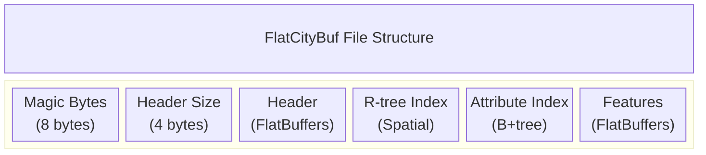

# flatcitybuf specification

## overview of the file format

flatcitybuf is a cloud-optimized binary format for storing and retrieving 3d city models based on the cityjson standard. it combines the semantic richness of cityjson with the performance benefits of flatbuffers binary serialization and spatial indexing techniques.

## flatbuffers schema explanation

flatcitybuf uses multiple schema files located in `src/fbs/` to define its structure:

### header.fbs

the `header.fbs` schema (see `src/fbs/header.fbs`) defines the metadata and indexing structures of a flatcitybuf file. The main `Header` table contains:

- **transform**: stores scale and translation vectors for vertex coordinates
- **appearance**: contains materials and textures information
- **columns**: schema for attribute data
- **attribute_index**: indexing for fast attribute queries
- **geographical_extent**: bounding box of the dataset
- **reference_system**: coordinate reference system information
- **templates**: geometry templates for repeated shapes
- **templates_verteces**: vertices for geometry templates (f64 precision)

### feature.fbs

the `feature.fbs` schema (see `src/fbs/feature.fbs`) defines the structure of city objects and their geometries. Key components include:

- **cityfeature**: the root object containing city objects and shared vertices
- **cityobject**: individual 3d features with type, geometry, and attributes
- **geometry**: complex structure for 3d geometries with boundaries and semantics
- **semanticobject**: semantic classification of geometry parts

### geometry.fbs

the `geometry.fbs` schema (see `src/fbs/geometry.fbs`) defines geometry structures including:

- **geometry**: standard geometry representation with boundaries and semantics
- **geometryinstance**: references to geometry templates with transformation matrices
- **transformationmatrix**: 4x4 transformation matrix for template instances
- **semanticobject**: semantic surface classifications

### extension.fbs

the `extension.fbs` schema (see `src/fbs/extension.fbs`) defines support for cityjson extensions:

- **extension**: contains extension metadata and schema definitions
- supports custom cityobject types and semantic surfaces
- enables extensibility while maintaining core format efficiency

### Geometry Template and Instance Encoding

FlatCityBuf supports CityJSON's Geometry Templates for efficient representation of repeated geometries.

**Template Definition**: Geometry templates are defined globally within the `Header` table using the `templates` and `templates_verteces` fields. Templates use f64 precision vertices stored in a global array.

**Instance Definition**: Individual CityObjects use `GeometryInstance` tables to reference templates with transformation matrices and reference points from the feature's vertex array.

This separation allows defining complex shapes once in the header and instantiating them multiple times within features using only an index, a reference point index, and a transformation matrix.

## file storage overview



each section is aligned to facilitate efficient http range requests, allowing clients to fetch only the parts they need.

## rtree indexing

flatcitybuf implements a packed r-tree for spatial indexing, based on the hilbert r-tree algorithm:

### encoding structure

the r-tree is stored as a flat array of node items. each node entry contains:

- **min_x, min_y**: minimum coordinates of 2d bounding box
- **max_x, max_y**: maximum coordinates of 2d bounding box
- **offset**: byte offset to the feature in the features section

note that the packed r-tree implementation is 2d only, using x and y coordinates. the z dimension is not included in the spatial indexing, though it remains part of the feature data.

### feature size determination

the size of each feature is not stored explicitly in the r-tree. instead, it is determined implicitly:

1. for non-leaf nodes: the size is not needed as they only point to other nodes
2. for leaf nodes: the size of a feature is determined by the difference between its offset and the offset of the next feature
3. for the last feature: the size extends to the end of the file

### hilbert ordering

features are ordered using a hilbert space-filling curve to improve spatial locality:

1. compute the hilbert value for each feature's centroid (using only x,y coordinates)
2. sort features by their hilbert values
3. build the r-tree bottom-up from the sorted features

### query algorithm

to query the r-tree:

1. start at the root node
2. for each entry in the node, check if the query intersects the 2d bounding box
3. if it's a leaf node, return the feature offsets
4. if it's an internal node, recursively query the child nodes

for 3d filtering, additional z-coordinate filtering must be performed after retrieving the features that match the 2d query.

## attribute indexing

flatcitybuf implements a b-tree-based index for efficient attribute queries:

### encoding structure

the attribute index is organized as a static/implicit b-tree structure with fixed-size entries (key + pointer). the byte size of the key depends on the attribute type.

- **internal nodes**: contain keys and pointers to child nodes
- **leaf nodes**: contain keys and offsets to features
- **node structure**: each node includes an entry count and next-node pointer (for leaf nodes)

### payload section

when duplicate keys exist within an index, a special payload section is used:

- **payload entries**: store arrays of offsets that point to features with the same key
- **payload reference**: leaf nodes store a tagged offset (MSB set to 1) that points to a payload entry
- **offset arrays**: each payload entry contains a count followed by an array of feature offsets

### payload optimization techniques

two major optimizations improve remote access efficiency:

1. **payload prefetching**: a configurable portion of the payload section is prefetched into a cache during initial query execution
2. **batch payload resolution**: payload references are collected during tree traversal and resolved in batches to minimize http requests

### serialization by type

different attribute types are serialized using the `keyencoder` trait:

- **integers**: stored in little-endian format with fixed size
- **floating point**: wrapped in `orderedfloat` to handle nan values properly
- **strings**: fixed-width prefix with utf-8 encoding and overflow handling
- **booleans**: single byte (0 for false, 1 for true)
- **datetimes**: normalized representation for efficient comparison

### query algorithm

the b-tree index supports various query operations:

- **exact match**: logarithmic search time through the tree height
- **range queries**: efficient traversal using linked leaf nodes
- **comparison operators**: =, !=, >, >=, <, <=
- **compound queries**: multiple conditions combined with logical and/or

## boundaries, semantics, and appearances encoding

### boundaries encoding

flatcitybuf uses a hierarchical indexing approach for geometry boundaries, following the dimensional hierarchy of cityjson:

the encoding strategy follows a dimensional hierarchy:

1. **indices/boundaries**: a flattened array of vertex indices
2. **strings**: each element represents the number of vertices in a string
3. **surfaces**: each element represents the number of strings in a surface
4. **shells**: each element represents the number of surfaces in a shell
5. **solids**: each element represents the number of shells in a solid

example encoding for a simple triangle:

```
boundaries: [0, 1, 2]  // vertex indices
strings: [3]           // 3 vertices in the string
surfaces: [1]          // 1 string in the surface
```

### semantics encoding

semantic information is stored in a hierarchical structure where each semantic object contains:

- type (e.g., wallsurface, roofsurface)
- attributes (specific to the semantic type)
- parent/children relationships (for hierarchical semantics)

### appearances encoding

appearances (materials and textures) are encoded with material and texture mappings that associate surfaces with specific materials and textures, allowing for detailed visual representation of city objects.

## attributes encoding

attributes in flatcitybuf are encoded as binary data with a schema defined in the header:

### column schema

each attribute has a column definition with index, name, and type information (see `Column` table in `src/fbs/header.fbs`).

### binary encoding

attributes are stored as a binary blob with values encoded according to their type:

- **numeric types**: native binary representation
- **string**: length-prefixed utf-8 string
- **boolean**: single byte (0 or 1)
- **json**: length-prefixed json string
- **binary**: length-prefixed binary data

### attribute access

to access an attribute:

1. find the column definition in the header
2. locate the attribute data in the feature's attributes array
3. deserialize according to the column type

## http range requests mechanism

flatcitybuf is designed for efficient access over http using range requests:

### range request workflow

1. **header retrieval**: client fetches magic bytes, header size, then header
2. **spatial query**: client traverses the r-tree index using range requests
3. **attribute query**: client traverses the attribute index using range requests
4. **feature retrieval**: client fetches features using their byte ranges

### optimization techniques

flatcitybuf implements several optimizations for http access:

1. **request batching**: nearby features are grouped to reduce http requests
2. **buffered client**: caches previously fetched data and implements speculative prefetching
3. **minimal header size**: kept small to minimize initial loading time
4. **progressive loading**: features are loaded on demand
5. **payload optimizations**:
   - **payload prefetching**: proactively caches parts of the payload section
   - **batch payload resolution**: combines multiple payload lookups into minimal http requests
   - **payload reference handling**: intelligently manages memory vs network efficiency tradeoffs

these optimizations work together to minimize latency and bandwidth usage when accessing flatcitybuf files over http.

## extension support

flatcitybuf implements full support for the cityjson extension mechanism through the schema defined in `src/fbs/extension.fbs`.

### extension mechanism background

cityjson extensions enable users to:

1. **add new attributes** to existing cityobjects
2. **create new cityobject types** beyond the standard types
3. **add new properties** at the root level of a cityjson file
4. **define new semantic surface types**

extensions are identified using a "+" prefix (e.g., "+noise").

### extension schema implementation

flatcitybuf supports extensions through:

1. **extension definition**: the `Extension` table stores extension metadata and schema definitions
2. **extended cityobjects**: special enum values (`ExtensionObject`) combined with `extension_type` strings
3. **extended semantic surfaces**: special enum values (`ExtraSemanticSurface`) combined with `extension_type` strings
4. **extension references**: extensions are listed in the header for discoverability

### encoding and decoding strategy

the encoding follows these principles:

1. **self-contained extensions**: extension schemas are embedded as stringified json
2. **enum with extension marker**: special enum values combined with string fields handle extended types
3. **unified attribute storage**: extension attributes are treated the same as core attributes
4. **root properties**: extension properties are stored in the header's attributes field
