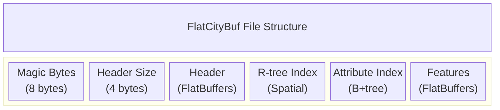

# flatcitybuf specification

> the byte-level sections below (file layout, packed r-tree, attribute b+tree, key
> encodings, operator lowering, http constants) were merged in from the "format
> reference" written during the native c++ port's implementation plan (retired after
> the port shipped; see git history under `docs/superpowers/plans/`). every
> constant, formula and byte offset there was cited to the rust source line that
> proves it; those citations are preserved unchanged below. **the rust implementation
> (`src/rust/fcb_core`) is the authoritative oracle for this format** — where any
> description in this document and the rust source disagree, the rust source wins.

## overview of the file format

flatcitybuf is a cloud-optimized binary format for storing and retrieving 3d city models based on the cityjson standard. it combines the semantic richness of cityjson with the performance benefits of flatbuffers binary serialization and spatial indexing techniques.

## flatbuffers schema explanation

flatcitybuf uses multiple schema files located in `src/fbs/` to define its structure:

### header.fbs

the `header.fbs` schema (see `src/fbs/header.fbs`) defines the metadata and indexing structures of a flatcitybuf file. The main `Header` table contains:

- **transform**: stores scale and translation vectors for vertex coordinates
- **appearance**: contains materials and textures information
- **columns**: schema for attribute data
- **attribute_index**: indexing for fast attribute queries
- **geographical_extent**: bounding box of the dataset
- **reference_system**: coordinate reference system information
- **templates**: geometry templates for repeated shapes
- **templates_verteces**: vertices for geometry templates (f64 precision)

### feature.fbs

the `feature.fbs` schema (see `src/fbs/feature.fbs`) defines the structure of city objects and their geometries. Key components include:

- **cityfeature**: the root object containing city objects and shared vertices
- **cityobject**: individual 3d features with type, geometry, and attributes
- **geometry**: complex structure for 3d geometries with boundaries and semantics
- **semanticobject**: semantic classification of geometry parts

### geometry.fbs

the `geometry.fbs` schema (see `src/fbs/geometry.fbs`) defines geometry structures including:

- **geometry**: standard geometry representation with boundaries and semantics
- **geometryinstance**: references to geometry templates with transformation matrices
- **transformationmatrix**: 4x4 transformation matrix for template instances
- **semanticobject**: semantic surface classifications

### extension.fbs

the `extension.fbs` schema (see `src/fbs/extension.fbs`) defines support for cityjson extensions:

- **extension**: contains extension metadata and schema definitions
- supports custom cityobject types and semantic surfaces
- enables extensibility while maintaining core format efficiency

### Geometry Template and Instance Encoding

FlatCityBuf supports CityJSON's Geometry Templates for efficient representation of repeated geometries.

**Template Definition**: Geometry templates are defined globally within the `Header` table using the `templates` and `templates_verteces` fields. Templates use f64 precision vertices stored in a global array.

**Instance Definition**: Individual CityObjects use `GeometryInstance` tables to reference templates with transformation matrices and reference points from the feature's vertex array.

This separation allows defining complex shapes once in the header and instantiating them multiple times within features using only an index, a reference point index, and a transformation matrix.

## file layout

```
[ magic 8B ][ header_size 4B LE ][ Header FlatBuffer ][ R-tree ][ Attr index ][ Features ]
```



**there is no padding or alignment between any of these sections.** the writer emits back-to-back `write_all` calls (`src/rust/fcb_core/src/writer/mod.rs:266-271`). sections are not aligned, and there are no section offsets stored anywhere — every offset below is computed, never read from the file.

| quantity | value / formula | citation |
|---|---|---|
| `MAGIC_BYTES` | `{'f','c','b',0x01,'f','c','b',0x00}` (8 bytes) | `const_vars.rs:5` |
| `VERSION` | `1`, at magic byte index **3** | `const_vars.rs:2` |
| magic validation | `b[0..3]=="fcb" && b[4..7]=="fcb" && b[3] <= 1`. Byte 7 is written as 0 but **never validated** | `lib.rs:56-58` |
| `header_size` | 4 bytes **LE u32**. This is the **FlatBuffers size prefix**, not a custom field. It excludes itself. | `reader/mod.rs:97-102` |
| header size guard | `8 <= header_size <= 536870912` (512 MB) else `IllegalHeaderSize` | `const_vars.rs:8`, `reader/mod.rs:97-102` |
| header root accessor | `GetSizePrefixedRoot<Header>` — buffer passed **includes** the 4 prefix bytes | `reader/mod.rs:104-110` |
| `header_len` | `8 + (4 + header_size)` | `http_reader/mod.rs:136` |
| `rtree_begin` | `header_len` | — |
| `rtree_size` | `0` if `index_node_size == 0 \|\| features_count == 0`, else `rtree_index_size(features_count, index_node_size)` (formula below) | `reader/mod.rs:266-275` |
| `attr_index_begin` | `header_len + rtree_size` | `http_reader/mod.rs:279` |
| `attr_index_size` | plain sum of `AttributeIndex.length()` over all header entries; `0` if absent | `reader/mod.rs:276-295` |
| `feature_begin` | `header_len + rtree_size + attr_index_size` | `http_reader/mod.rs:280` |

all hand-serialized sections (r-tree, attribute b+tree, feature-length prefixes) are little-endian; flatbuffers handles its own endianness internally.

### features

- each feature is a **size-prefixed FlatBuffer**: 4-byte **LE u32** prefix excluding itself, then the buffer
  (`reader/mod.rs:539-545`, `:569-572`; written by `finish_size_prefixed` at `writer/feature_writer.rs:83`).
- root accessor: `GetSizePrefixedRoot<CityFeature>`; buffer passed **includes** the prefix.
- **no padding between features** (`writer/mod.rs:225-244`, `:271`).
- features are stored in **Hilbert order**, not input order (`writer/mod.rs:202-203`) — see "hilbert ordering" below.
- **feature byte length is not stored in the index.** it is either (a) the feature's own 4-byte prefix, or (b) `next_leaf.offset - this_leaf.offset`. for the *last* feature only (a) is available, which is why a reader must know the total file size.

## rtree indexing

flatcitybuf implements a packed r-tree for spatial indexing, based on the hilbert r-tree algorithm.

### encoding structure

the r-tree is stored as a flat array of `NodeItem` entries, all little-endian, no padding:

| quantity | value / formula | citation |
|---|---|---|
| `NodeItem` | `{ f64 min_x, f64 min_y, f64 max_x, f64 max_y, u64 offset }`, all **LE**, **40 bytes**, no padding | `packed_rtree/mod.rs:23-33`, `:56-77` |
| `DEFAULT_NODE_SIZE` | `16`, clamped to `[2, 65535]` | `packed_rtree/mod.rs:325`, `:330` |
| `rtree_index_size(n, ns)` | `ns=clamp(ns,2,65535); num_nodes=n; loop { n=ceil_div(n,ns); num_nodes+=n; if n==1 break } return num_nodes*40` | `packed_rtree/mod.rs:879-898` |
| level bounds | `level_bounds[0]` is the **leaf** level and is **last in storage order**; `level_bounds.back()` is the root `0..1` | `packed_rtree/mod.rs:342-375` |
| internal node `offset` | a **child node index**, not a byte offset | `packed_rtree/mod.rs:385`, `:531` |
| leaf node `offset` | byte offset **relative to `feature_begin`** | `writer/mod.rs:207-215` |
| leaf test (stream) | `node_index >= num_nodes - num_items` | `packed_rtree/mod.rs:702` |
| last-feature range | `RangeFrom(start..)` — read the 4-byte prefix first | `packed_rtree/mod.rs:962-975` |
| leaf fetch +1 rule | when descending into level 0, extend the node range by one extra node (clamped to `level_bounds[0].end`) so the next offset is available | `packed_rtree/mod.rs:979-987` |

- **min_x, min_y**: minimum coordinates of the 2d bounding box
- **max_x, max_y**: maximum coordinates of the 2d bounding box
- **offset**: as above — a child node index for internal nodes, a feature-section-relative byte offset for leaf nodes

note that the packed r-tree implementation is 2d only, using x and y coordinates. the z dimension is not included in the spatial indexing, though it remains part of the feature data.

### feature size determination

the size of each feature is not stored explicitly in the r-tree. instead, it is determined implicitly:

1. for non-leaf nodes: the size is not needed as they only point to other nodes
2. for leaf nodes: the size of a feature is determined by the difference between its offset and the offset of the next feature (the "leaf fetch +1 rule" above)
3. for the last feature: there is no next offset, so the reader falls back to the feature's own 4-byte length prefix and must know the total file size to read it (`RangeFrom(start..)`, `packed_rtree/mod.rs:962-975`)

### hilbert ordering

features are ordered using a hilbert space-filling curve to improve spatial locality. **this is writer-only — a reader never computes it**; it compares stored bboxes and follows offsets. listed here only for completeness:

1. compute the hilbert value for each feature's centroid, using only x,y coordinates: `floor(65535.0 * (centroid - extent.min) / extent.size)`, with `HILBERT_MAX = 65535` (`packed_rtree/mod.rs:233`, `:291-298`)
2. sort features by their hilbert values
3. build the r-tree bottom-up from the sorted features

### query algorithm

to query the r-tree:

1. start at the root node
2. for each entry in the node, check if the query intersects the 2d bounding box
3. if it's a leaf node, return the feature offsets
4. if it's an internal node, recursively query the child nodes

for 3d filtering, additional z-coordinate filtering must be performed after retrieving the features that match the 2d query.

## attribute indexing

flatcitybuf implements a static (implicit) b+tree index for efficient attribute queries. the attribute index section is a **bare concatenation of per-column blobs in ascending `Column.index` order**, with no per-index header and no separator. each per-column blob is `[ num_all_nodes × Entry<K> ][ payload section ]` (`static_btree/stree.rs:1520-1535`).

### encoding structure

| quantity | value / formula | citation |
|---|---|---|
| `AttributeIndex` (header struct) | `{ ushort index; uint length; ushort branching_factor; uint num_unique_items; }` — **16 bytes, not 12**: field order forces 2 bytes of padding after each `ushort`. Wire layout: `0:u16 index, 2:pad, 4:u32 length, 8:u16 branching_factor, 10:pad, 12:u32 num_unique_items`. Confirmed in the generated code: Rust `pub struct AttributeIndex(pub [u8; 16])` (`fb/header_generated.rs:810`) and C++ `FLATBUFFERS_MANUALLY_ALIGNED_STRUCT(4)` with explicit `padding0__`/`padding1__` members. | `src/fbs/header.fbs:65-70` |
| `length` | byte length of the whole blob **including** its payload section | — |
| `num_unique_items` | number of **unique keys** (= leaf count), NOT feature count | — |
| locating column `i` | `attr_index_begin + Σ length of preceding entries` (sorted by `index()`) | `reader/attr_query.rs:309-337` |
| `Entry<K>` | `key: K` then `offset: u64 LE`. `SERIALIZED_SIZE = K::SERIALIZED_SIZE + 8` | `static_btree/entry.rs:25-52` |
| node size for **search** | `branching_factor - 1` entries | `stree.rs:743`, `:826`, `:1087` |
| level-bounds divisor | `branching_factor`, and the loop breaks when **`n < branching_factor`** (NOT `n == 1` — this differs from the R-tree and is intentional) | `stree.rs:462-497` |
| `stree_index_size(n, bf, payload)` | `bf=clamp(bf,2,65535); num_nodes=n; loop { n=ceil_div(n,bf); num_nodes+=n; if n<bf break } return num_nodes*ENTRY + payload` | `stree.rs:1480-1501` |
| `payload_data_start` | `index_begin + num_all_nodes * Entry<K>::SERIALIZED_SIZE` | `stree.rs:1442-1444` |
| payload size | `length - num_all_nodes * Entry<K>::SERIALIZED_SIZE` | derived |
| `PAYLOAD_TAG` | `1u64 << 63`; `PAYLOAD_MASK = ~PAYLOAD_TAG` | `stree.rs:15-17` |
| payload entry | `u32 count LE` then `count × u64 LE`; size `4 + count*8` | `static_btree/payload.rs:36-61` |
| payload offset base | tagged value's low 63 bits are **relative to the payload section start** | `stree.rs:652-659` |
| leaf sibling pointers | **none.** Range scans walk the contiguous leaf array by index. The doc comment at `entry.rs:15` claiming otherwise is stale and false. | `stree.rs:626-679` |
| `SearchResultItem.offset` | feature-section-relative byte offset | `stree.rs:378-384` |

in prose:

- **internal nodes**: contain keys and pointers (child node indices) to child nodes
- **leaf nodes**: contain keys and either a direct feature offset or a tagged payload reference
- **payload reference**: leaf nodes store a tagged offset (bit 63 set, `PAYLOAD_TAG`) that points into the payload section; a plain (untagged) offset is a direct, feature-section-relative byte offset — used when a key has exactly one match
- **payload entries**: store arrays of offsets that point to features with the same key, for keys with more than one match
- there are **no leaf sibling/next pointers** — range scans walk the contiguous leaf array by index, not a linked list

### payload optimization techniques

two major optimizations improve remote access efficiency:

1. **payload prefetching**: a configurable portion of the payload section is prefetched into a cache during initial query execution — see `payload_data_start` and the HTTP "payload prefetch size" formula below
2. **batch payload resolution**: payload references are collected during tree traversal and resolved in batches to minimize http requests

### key encodings

**Key encodings** (`static_btree/key.rs`), all integers LE:

| KeyType | Size | Encoding | Citation |
|---|---|---|---|
| Int8 / UInt8 | 1 | raw byte | `key.rs:284-314` |
| Int16/UInt16/Int32/UInt32/Int64/UInt64 | 2/2/4/4/8/8 | LE two's complement | `key.rs:260-280` |
| Float32 | 4 | **raw IEEE-754 LE bits** | `key.rs:323-345` |
| Float64 | 8 | **raw IEEE-754 LE bits** | `key.rs:347-370` |
| Bool | 1 | `0`/`1`; read as `byte != 0` | `key.rs:373-393` |
| DateTime | **12** | `i64 LE` UNIX seconds, then `u32 LE` subsec nanos | `key.rs:396-425` |
| FixedStringKey\<N\>, N ∈ {20,50,100} | N | raw N bytes, zero-padded, silently truncated at the **byte** level (can split UTF-8). No length, no terminator. | `key.rs:434-464`, `:483-489` |

**There is NO sign-flip / total-order bit transform for floats.** On-disk bytes are the plain IEEE-754 bit pattern. Ordering is `ordered_float` semantics applied *after* decode: NaN sorts greatest, NaN == NaN, `-0.0 == +0.0`.

**Column type → key type**, as the writer actually emits (`writer/attr_index.rs:240`, `:272`, `:288`):
`Bool→bool, Byte→u8, UByte→u8, Short→i16, UShort→u16, Int→i32, UInt→u32, Long→i64, ULong→u64, Float→f32, Double→f64, String→FixedStringKey<50>, DateTime→DateTime, Json→FixedStringKey<100>, Binary→FixedStringKey<100>`.

`StringKey20` is defined but **never produced by the writer**.

### query algorithm

the b+tree index supports the following operators, each lowered to one or two tree traversals (`static_btree/query/stream.rs:161-191`):

`Eq→find_exact`; `Ge→find_range(key, MAX)`; `Le→find_range(MIN, key)`; `Gt→find_range(key, MAX) minus find_exact(key)`; `Lt→find_range(MIN, key) minus find_exact(key)`; `Ne→find_range(MIN, MAX) minus find_exact(key)`.

multi-condition queries are **AND**-intersected sequentially with early exit on empty (`stream.rs:402-423`).

- **exact match**: logarithmic search time through the tree height, via `find_exact`
- **range queries**: traversal via `find_range`, walking the contiguous leaf array by index (there is no linked-leaf structure)
- **comparison operators**: `=`, `!=`, `>`, `>=`, `<`, `<=`, lowered as above
- **compound queries**: multiple conditions combined with AND

### known divergences from the Rust reader (deliberate)

these are cases where Rust's reader disagrees with Rust's own writer, or where a sentinel is arguably wrong. each is a decision, not an oversight, reproduced identically by the C++ and Python ports so all implementations agree:

1. **`Byte` columns: the writer stores `u8`, but Rust's reader decodes `i8`.** The writer stores `Byte` as `u8` (`writer/attribute.rs:209`) and builds its index as `MemoryIndex<u8>` (`writer/attr_index.rs:240`), but the reader decodes that index as `i8` (`reader/attr_query.rs:118`). For stored values > 127 the Rust reader therefore returns a negative number that was never written. **C++ and Python match the writer (`u8`)** — decoding files correctly beats bug-compatibility with the reader. Consequence: they disagree with Rust's reader on `Byte` queries for values > 127 until Rust is fixed (filed in `docs/upstream-findings.md`).
   Note also that normal attribute extraction does not even create index entries for `Byte`, `UByte`, `Short`, `UShort` and several other declared types — they fall through to "not supported" (`writer/attribute.rs:327`). So in practice this path is rarely exercised; correctness still matters for hand-built and third-party files.
2. **`Json`/`Binary` columns are indexed by the writer but rejected by the Rust reader** with `UnsupportedColumnType` (`reader/attr_query.rs:273`). C++ and Python mirror the rejection — these are `FixedStringKey<100>` over a JSON/binary blob, so index hits are near-meaningless without post-verification, and rejecting is honest.
3. **Float `max_value()` is `+inf`, but NaN sorts above `+inf`** in the `ordered_float` total order (`static_btree/key.rs:139`). Range-lowered operators (`Ge`, `Ne`) therefore silently **exclude NaN-keyed features**. All ports reproduce this so query results match Rust.
4. **DateTime `min_value()` is epoch 0** (`static_btree/key.rs:242`) even though the wire format stores a signed `i64` and permits negative seconds. Pre-1970 timestamps are therefore invisible to `Le`/`Ne` range queries. All ports reproduce this.

## boundaries, semantics, and appearances encoding

### boundaries encoding

flatcitybuf uses a hierarchical indexing approach for geometry boundaries, following the dimensional hierarchy of cityjson:

the encoding strategy follows a dimensional hierarchy:

1. **indices/boundaries**: a flattened array of vertex indices
2. **strings**: each element represents the number of vertices in a string
3. **surfaces**: each element represents the number of strings in a surface
4. **shells**: each element represents the number of surfaces in a shell
5. **solids**: each element represents the number of shells in a solid

example encoding for a simple triangle:

```
boundaries: [0, 1, 2]  // vertex indices
strings: [3]           // 3 vertices in the string
surfaces: [1]          // 1 string in the surface
```

### semantics encoding

semantic information is stored in a hierarchical structure where each semantic object contains:

- type (e.g., wallsurface, roofsurface)
- attributes (specific to the semantic type)
- parent/children relationships (for hierarchical semantics)

### appearances encoding

appearances (materials and textures) are encoded with material and texture mappings that associate surfaces with specific materials and textures, allowing for detailed visual representation of city objects.

## attributes encoding

attributes in flatcitybuf are encoded as binary data with a schema defined by `Column` entries (see `Column` table in `src/fbs/header.fbs`).

### column schema

each attribute has a column definition with index, name, and type information. `Header.columns` is the file-level schema, but it is **not always the schema an object was encoded against** — see "attribute schema resolution" below.

### binary encoding

attributes are stored as a binary blob with values encoded according to their type:

- **numeric types**: native binary representation
- **string**: length-prefixed utf-8 string
- **boolean**: single byte (0 or 1)
- **json**: length-prefixed json string
- **binary**: length-prefixed binary data

### attribute schema resolution — per object, not per file

attributes must be decoded against the schema of the `CityObject` that owns them, not blindly against `Header.columns`:

- `CityObject.columns` overrides `Header.columns` whenever it is set (`src/fbs/feature.fbs`, and the comment there says so explicitly).
- this is the normal case, not an edge case: in `examples/data/delft.fcb`, **all 1115 objects that carry attributes declare their own columns**, and the header's 44 columns are never used for decoding.
- objects within one feature differ: the `Building` parent carries no attributes while its `BuildingPart` child carries them all. code must walk all objects rather than assuming object 0.
- getting this wrong does **not** fail loudly. attribute records are not self-delimiting — each value's width comes from its column's type — so a wrong schema desynchronises the remainder of the blob and yields plausible-looking garbage instead of an error. it surfaced as a nonsense column index (28777, which is ASCII `"ip"` from the middle of a string value) during the native C++ port.

### attribute access

to access an attribute:

1. resolve the schema: the owning `CityObject`'s own `columns`, if set, otherwise `Header.columns` (see above)
2. locate the attribute data in the feature's attributes array
3. deserialize according to the resolved column type

## http range requests mechanism

flatcitybuf is designed for efficient access over http using range requests.

### range request workflow

1. **header retrieval**: client fetches magic bytes, header size, then header
2. **spatial query**: client traverses the r-tree index using range requests
3. **attribute query**: client traverses the attribute index using range requests
4. **feature retrieval**: client fetches features using their byte ranges

### http constants

| quantity | value | citation |
|---|---|---|
| `DEFAULT_HTTP_FETCH_SIZE` | `1048576` (1 MB) | `http_reader/mod.rs:42` |
| open prefetch | `2024 + (1+16+256)*40 = 12944` bytes | `http_reader/mod.rs:80-98` |
| combine threshold (bbox) | `256*1024` | `http_reader/mod.rs:213` |
| combine threshold (attr) | `1024*1024` | `http_reader/mod.rs:363` |
| feature batching rule | `wasted = next.start - prev_end`; same batch if `wasted < threshold` | `http_reader/mod.rs:612-650` |
| batch request size | `(first.start .. last.start + last.len.value_or(4))`, capped at 1 MB | `http_reader/mod.rs:659-681` |
| payload prefetch size | `clamp(ceil(num_items*0.1) * 64, 16*1024, 4*1024*1024)` | `stree.rs:417-443` |

### optimization techniques

flatcitybuf implements several optimizations for http access:

1. **request batching**: nearby features are grouped to reduce http requests, per the "feature batching rule" and "batch request size" above
2. **buffered client**: caches previously fetched data (bounded by `DEFAULT_HTTP_FETCH_SIZE`) and implements speculative prefetching (the "open prefetch" above covers the header plus the top few r-tree levels)
3. **minimal header size**: kept small to minimize initial loading time
4. **progressive loading**: features are loaded on demand
5. **payload optimizations**:
   - **payload prefetching**: proactively caches parts of the payload section, sized per the "payload prefetch size" formula above
   - **batch payload resolution**: combines multiple payload lookups into minimal http requests
   - **payload reference handling**: intelligently manages memory vs network efficiency tradeoffs

these optimizations work together to minimize latency and bandwidth usage when accessing flatcitybuf files over http.

## extension support

flatcitybuf implements full support for the cityjson extension mechanism through the schema defined in `src/fbs/extension.fbs`.

### extension mechanism background

cityjson extensions enable users to:

1. **add new attributes** to existing cityobjects
2. **create new cityobject types** beyond the standard types
3. **add new properties** at the root level of a cityjson file
4. **define new semantic surface types**

extensions are identified using a "+" prefix (e.g., "+noise").

### extension schema implementation

flatcitybuf supports extensions through:

1. **extension definition**: the `Extension` table stores extension metadata and schema definitions
2. **extended cityobjects**: special enum values (`ExtensionObject`) combined with `extension_type` strings
3. **extended semantic surfaces**: special enum values (`ExtraSemanticSurface`) combined with `extension_type` strings
4. **extension references**: extensions are listed in the header for discoverability

### encoding and decoding strategy

the encoding follows these principles:

1. **self-contained extensions**: extension schemas are embedded as stringified json
2. **enum with extension marker**: special enum values combined with string fields handle extended types
3. **unified attribute storage**: extension attributes are treated the same as core attributes
4. **root properties**: extension properties are stored in the header's attributes field
