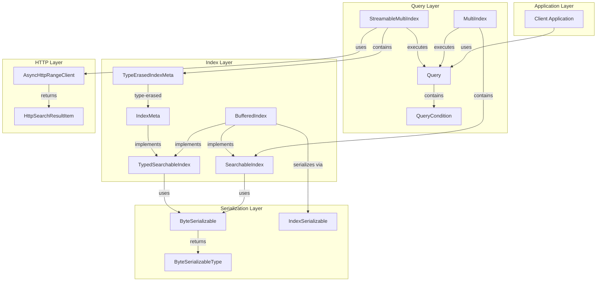
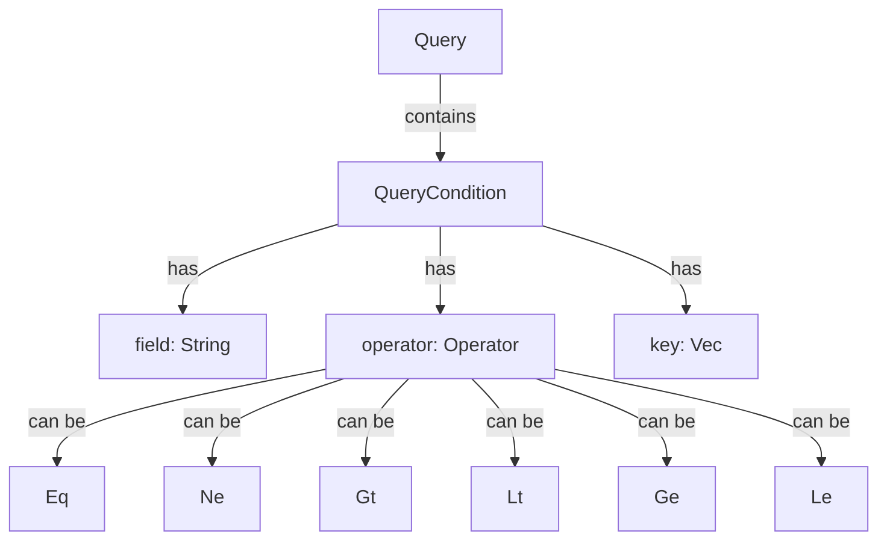
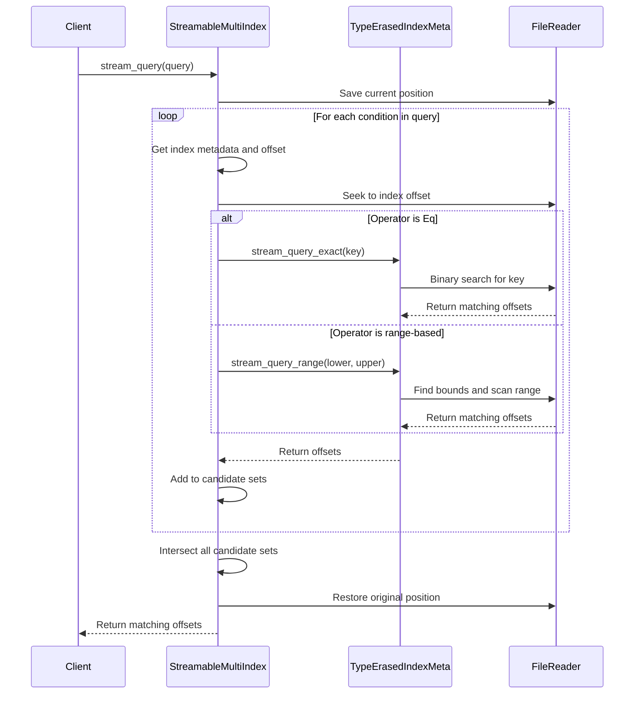
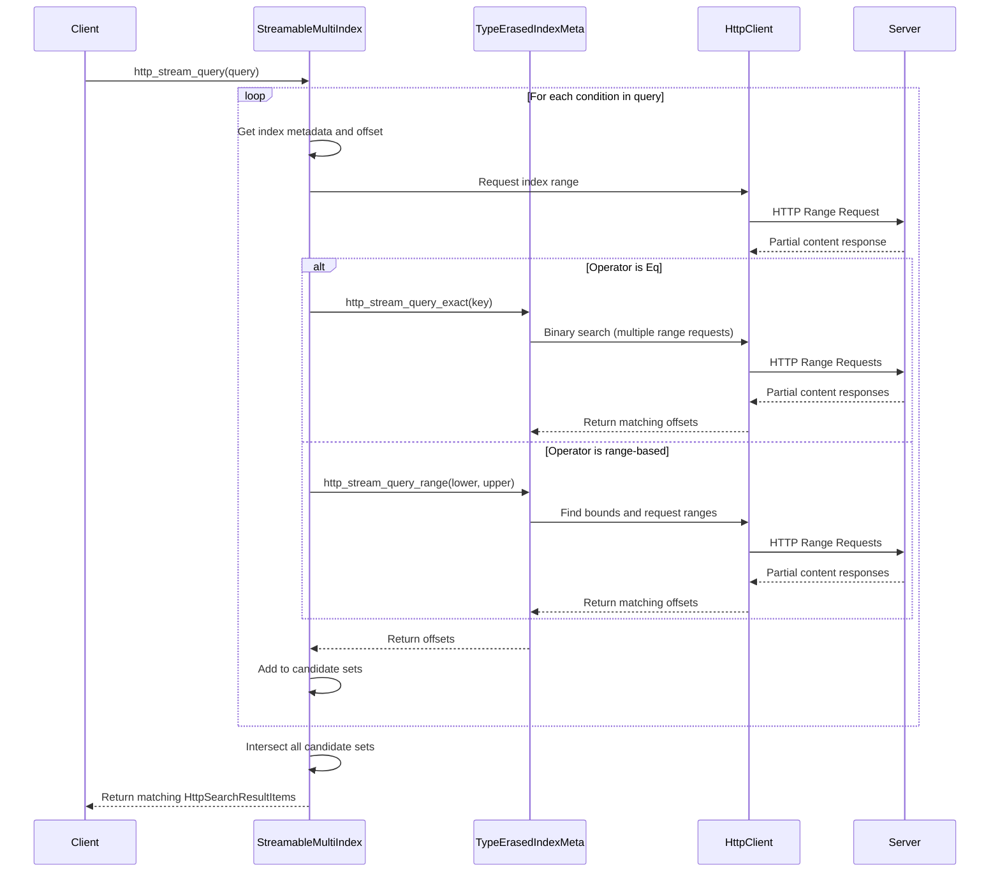

# FlatCityBuf Implementation Strategy

## Core Architecture

FlatCityBuf uses a multi-layered architecture for efficient spatial data indexing and querying:

1. **Index Layer**: Provides efficient key-value lookups with support for exact matches and range queries
2. **Query Layer**: Handles complex queries with multiple conditions across different indices
3. **Serialization Layer**: Enables persistent storage and streaming access to indices
4. **HTTP Layer**: Allows remote access to indices via HTTP range requests



## Type System

The type system in FlatCityBuf is built around the `ByteSerializable` trait, which provides methods for converting types to and from byte representations:

```rust
pub trait ByteSerializable: Send + Sync {
    fn to_bytes(&self) -> Vec<u8>;
    fn from_bytes(bytes: &[u8]) -> Self;
    fn value_type(&self) -> ByteSerializableType;
}
```

Key features:
- Implemented for common types (primitives, String, DateTime, etc.)
- Uses `OrderedFloat` for floating-point comparisons to handle NaN values
- Preserves type information in serialized format via `ByteSerializableType` enum
- Enables type-specific comparisons during binary search operations

The `ByteSerializableType` enum represents all supported types:

```rust
pub enum ByteSerializableType {
    I64, I32, I16, I8,
    U64, U32, U16, U8,
    F64, F32,
    Bool,
    String,
    NaiveDateTime, NaiveDate, DateTime,
}
```

Each type has a unique ID that is stored in the serialized index, allowing for correct type-specific comparisons when querying.

## Index Implementation

### BufferedIndex

The `BufferedIndex<T>` is an in-memory index implementation that stores key-value pairs where:
- Keys are of type `T` (which must be `Ord + ByteSerializable`)
- Values are vectors of offsets (`Vec<ValueOffset>`) pointing to the actual data

```rust
pub struct BufferedIndex<T: Ord + ByteSerializable + Send + Sync + 'static> {
    pub entries: Vec<KeyValue<T>>,
}
```

Key features:
- Maintains keys in sorted order for efficient binary search
- Supports exact match and range queries
- Fully type-aware with generic parameter `T`
- Implements both `SearchableIndex` and `TypedSearchableIndex` traits

### IndexMeta

The `IndexMeta<T>` structure provides metadata about an index and enables streaming access without loading the entire index into memory:

```rust
pub struct IndexMeta<T: Ord + ByteSerializable + Send + Sync + 'static> {
    /// Number of entries in the index.
    pub entry_count: u64,
    /// Total size of the index in bytes.
    pub size: u64,
    /// Phantom data to represent the type parameter.
    pub _phantom: std::marker::PhantomData<T>,
}
```

Key features:
- Stores only metadata, not the actual index data
- Provides methods for streaming queries directly from a file or HTTP source
- Uses binary search for efficient lookups
- Implements `TypedStreamableIndex<T>` trait for type-safe streaming access

### TypeErasedIndexMeta

The `TypeErasedIndexMeta` structure is a type-erased version of `IndexMeta<T>` that can work with any `ByteSerializable` type:

```rust
pub struct TypeErasedIndexMeta {
    /// Number of entries in the index.
    pub entry_count: u64,
    /// Total size of the index in bytes.
    pub size: u64,
    /// Type identifier for the index.
    pub type_id: ByteSerializableType,
}
```

Key features:
- Enables storing different index types in a single collection
- Performs type-specific comparisons based on the `type_id`
- Used by `StreamableMultiIndex` to handle multiple indices with different key types

## Query System

### Query Structure

Queries are represented by the `Query` struct which contains a list of conditions:

```rust
pub struct Query {
    pub conditions: Vec<QueryCondition>,
}

pub struct QueryCondition {
    /// The field identifier (e.g., "id", "name", etc.)
    pub field: String,
    /// The comparison operator.
    pub operator: Operator,
    /// The key value as a byte vector (obtained via ByteSerializable::to_bytes).
    pub key: Vec<u8>,
}
```

The system supports six comparison operators:
- `Eq`: Equal to
- `Ne`: Not equal to
- `Gt`: Greater than
- `Lt`: Less than
- `Ge`: Greater than or equal to
- `Le`: Less than or equal to



### MultiIndex

The `MultiIndex` provides a way to query multiple indices simultaneously:

```rust
pub struct MultiIndex {
    /// A mapping from field names to their corresponding index.
    pub indices: HashMap<String, Box<dyn SearchableIndex>>,
}
```

Key features:
- Stores multiple indices by field name
- Executes queries across all relevant indices
- Intersects results to find records that match all conditions
- Uses trait objects (`Box<dyn SearchableIndex>`) for type erasure

### StreamableMultiIndex

The `StreamableMultiIndex` extends the concept of `MultiIndex` for streaming access:

```rust
pub struct StreamableMultiIndex {
    /// A mapping from field names to their corresponding index metadata.
    pub indices: HashMap<String, TypeErasedIndexMeta>,
    /// A mapping from field names to their offsets in the file.
    pub index_offsets: HashMap<String, u64>,
}
```

Key features:
- Stores index metadata and offsets instead of the actual indices
- Enables streaming queries without loading entire indices into memory
- Properly manages cursor positioning when querying multiple indices
- Supports the same query operators as `MultiIndex`

## Streaming Query Process

The streaming query process follows these steps:



1. **Initialization**:
   - Save the current file position
   - Identify the relevant indices for the query conditions

2. **Query Execution**:
   - For each condition in the query:
     - Find the corresponding index metadata and offset
     - Seek to the correct offset in the file
     - Execute the appropriate query method (exact or range)
     - Collect the results into a candidate set

3. **Result Combination**:
   - Intersect all candidate sets to find records that match all conditions
   - Sort the results for consistent output

4. **Cursor Management**:
   - Restore the original file position after the query is complete

## HTTP Streaming Queries

The HTTP implementation extends the streaming concept to remote data sources:



Key components:

1. **AsyncHttpRangeClient**:
   - Makes HTTP range requests to fetch specific byte ranges
   - Buffers data to minimize the number of requests
   - Handles network errors and retries

2. **HTTP Streaming Queries**:
   - Follow the same pattern as file-based streaming queries
   - Use range requests to fetch only the necessary parts of the index
   - Return `HttpSearchResultItem` objects with byte ranges for feature data

3. **Batching Strategy**:
   - Group nearby offsets to reduce the number of HTTP requests
   - Use a threshold parameter to control the maximum distance between offsets in a batch
   - Balance between minimizing requests and avoiding excessive data transfer

## Serialization Strategy

### Format

Each index is serialized with the following structure:

```
[Type Identifier (4 bytes)]
[Number of Entries (8 bytes)]
For each entry:
  [Key Length (8 bytes)]
  [Key Bytes (variable)]
  [Number of Offsets (8 bytes)]
  For each offset:
    [Offset Value (8 bytes)]
```

This format:
- Preserves type information for correct deserialization
- Maintains the sorted order of keys
- Allows efficient binary search directly on the serialized data
- Supports streaming access without loading the entire index

## Integration with CityJSON

FlatCityBuf is designed to optimize CityJSON for cloud-based applications:

1. **Binary Encoding**:
   - Reduces file size by 50-70% compared to JSON-based CityJSONSeq
   - Preserves all semantic information from the original CityJSON

2. **Spatial Indexing**:
   - Implements Hilbert R-tree for efficient spatial queries
   - Enables fast retrieval of city objects by location

3. **Attribute Indexing**:
   - Creates indices for commonly queried attributes
   - Supports complex queries combining spatial and attribute conditions

4. **Cloud Optimization**:
   - Enables partial data retrieval via HTTP range requests
   - Reduces bandwidth usage by downloading only needed data
   - Improves loading times for web applications

## Performance Considerations

1. **Memory Efficiency**:
   - Only metadata is loaded into memory, not the entire index
   - Streaming access minimizes memory usage for large datasets
   - Type-erased indices reduce memory overhead for multiple indices

2. **I/O Optimization**:
   - Binary search minimizes the number of reads
   - Cursor positioning is carefully managed to avoid unnecessary seeks
   - Batched HTTP requests reduce network overhead

3. **Type Safety**:
   - Type information is preserved in the serialized format
   - Type-specific comparisons ensure correct ordering
   - Generic implementations provide type safety at compile time

4. **Query Optimization**:
   - Conditions are processed in order, with no specific optimization yet
   - Future improvements could include reordering conditions based on selectivity
   - Caching frequently accessed index parts could improve performance

## Future Enhancements

1. **Query Optimization**:
   - Implement query planning to reorder conditions for optimal performance
   - Add statistics collection for better selectivity estimation

2. **Advanced HTTP Optimizations**:
   - Implement predictive prefetching for common query patterns
   - Add support for HTTP/2 multiplexing to reduce connection overhead

3. **Compression**:
   - Add optional compression for index and feature data
   - Support for compressed HTTP range requests

4. **Integration with Other Formats**:
   - Extend the approach to other geospatial formats
   - Add support for vector tiles and other web-friendly formats
