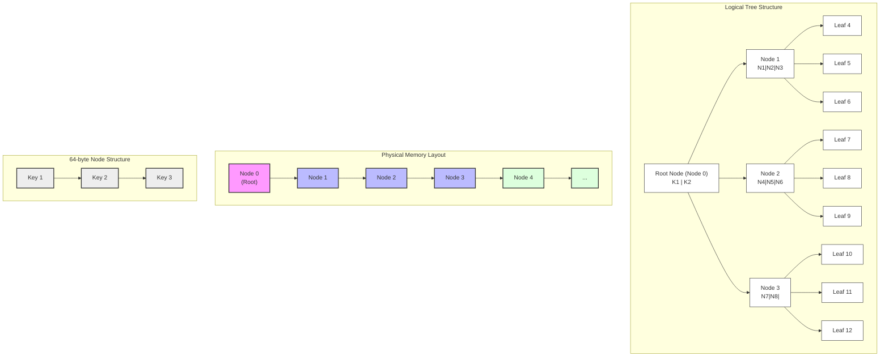

# Implicit B+Tree (S+Tree) Implementation Strategy

This document outlines the implementation strategy for our static B+tree, based on the S+tree concept described in the [Algorithmica article](https://en.algorithmica.org/hpc/data-structures/s-tree/) and [this article](https://curiouscoding.nl/posts/static-search-tree/#s-trees-and-b-trees).

## Core Concepts

### Traditional B-trees vs Static B+trees

Traditional B-trees use a node structure with:

- Keys
- Child pointers
- Empty space for future insertions
- Typically 50-70% space utilization

Our static B+tree (S+tree) implementation differs in several key ways:

- No explicit pointers between nodes.
- Complete filling of nodes (except possibly the last node at each level)
- Implicit relationship between parent and child nodes based on array indices
- Nearly 100% space utilization

### Implicit Node Numbering

In a traditional B-tree with pointers, each node contains explicit references to its children. In our implicit layout:

1. We number nodes using a generalized Eytzinger layout:
   - The root node is numbered 0
   - For a node with index k and branching factor B, its B child nodes are numbered `{k * (B + 1) + i + 1}` for i ∈ [0, B]

2. This numbering allows us to navigate the tree using simple arithmetic:

   ```rust
   fn child_index(node_index: usize, branch: usize, branch_factor: usize) -> usize {
       node_index * (branch_factor + 1) + branch + 1
   }
   ```

### Memory Layout

The entire tree is stored as a single contiguous array of nodes, with:

1. Nodes arranged by level, with the root node first
2. Each node containing exactly B keys (except possibly the last node at each level)
3. No explicit pointers between nodes
4. Keys within each node sorted in ascending order

This layout offers several advantages:

- Better cache locality
- No pointer indirection
- More efficient memory usage
- Simplified serialization/deserialization

Example layout for a tree with branching factor B=3:



## Node Structure

Each node in our static B+tree consists of:

1. A fixed number of keys (determined by the branching factor)
2. No explicit pointers to child nodes (these are computed)

The physical structure of a node is optimized for cache line efficiency:

- For a branching factor of 16, each node contains 16 fixed-width keys

## Search Algorithm

The search algorithm leverages the implicit structure:

1. Start at the root node (index 0)
2. Within each node, find the appropriate branch using:
   - Binary search for basic implementation
3. Compute the child node index using the formula
4. Continue until reaching a leaf node
5. In the leaf node, find the exact match for the key

## Construction Algorithm

Building the static B+tree involves:

1. Sorting all entries (if not already sorted)
2. Computing the number of nodes needed for each level
3. Allocating a single contiguous array for all nodes
4. Filling nodes in a bottom-up fashion:
   - Fill leaf nodes first
   - Then fill internal nodes with keys that represent the smallest key in each child subtree

## Range Queries

Unlike traditional B+trees which use a linked list of leaf nodes, our implementation:

1. Finds the leaf containing the start key
2. Uses the implicit layout to find neighboring leaves
3. Scans contiguous leaf nodes until reaching the end key

This approach maintains the cache efficiency advantages while supporting efficient range queries.

## Configurable Branching Factor

The branching factor is configurable at tree creation time:

- Default of 16 (aligns with 64-byte cache line for many key types)
- Can be increased for wider keys or to reduce tree height
- Can be decreased for smaller memory footprint

The optimal branching factor depends on:

- Key size
- Cache line size of the target architecture
- Total number of entries
- Access patterns

## Comparison with Existing Implementation

Compared to the current btree crate, our static-btree implementation:

1. Offers significantly faster search (up to 15x for large datasets)
2. Has better cache efficiency due to optimized memory layout
3. Does not support modifications after construction

These tradeoffs make it ideal for read-heavy workloads with static data.
