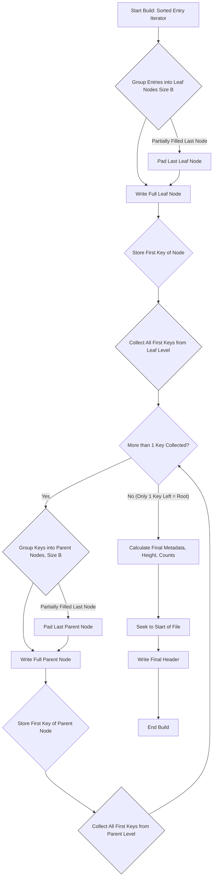
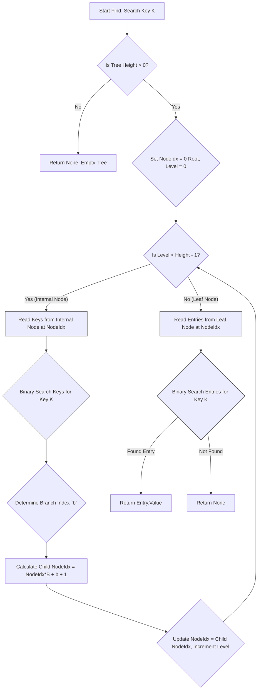

# Rust Static B+Tree (S+Tree) Implementation Plan (Detailed)

## 1. Introduction

This document outlines the implementation strategy and detailed Rust API signatures for a static, implicit B+Tree (S+Tree). The goal is to create a highly performant, read-optimized B+Tree suitable for large, static datasets, emphasizing cache efficiency and minimal memory usage during queries.

The implementation follows the principles described in the [Algorithmica S+Tree article](https://en.algorithmica.org/hpc/data-structures/s-tree/), utilizing an implicit Eytzinger layout for node addressing and storing the entire tree structure contiguously.

## 2. Core Concepts

* **Static:** Built once, read many times. No modifications after build.
* **Implicit Layout (Eytzinger):** Nodes located arithmetically, not via pointers. Stored contiguously, often level-by-level.
* **Packed Nodes:** Nodes are fully utilized (except potentially the last one per level) for better space and cache efficiency.
* **Read Optimization:** Designed for fast lookups and range scans by minimizing I/O (reading only needed nodes).
* **`Read + Seek` Abstraction:** Operates on standard Rust I/O traits, enabling use with files, memory, etc.

## 3. Error Handling

Consolidates potential issues during build or query phases.

```rust
use std::io;

/// Custom error type for StaticBTree operations.
#[derive(Debug)] // Implement std::error::Error for full integration
pub enum Error {
    /// Errors originating from the underlying Read/Seek/Write operations.
    IoError(io::Error),
    /// Errors indicating the data format is incorrect (e.g., bad magic bytes, wrong version).
    InvalidFormat(String),
    /// Errors during the serialization of a key.
    KeySerializationError(String),
    /// Errors during the deserialization of a key.
    KeyDeserializationError(String),
    /// Errors specific to the tree building process (e.g., unsorted input).
    BuildError(String),
    /// Errors specific to querying (e.g., trying to access invalid node index).
    QueryError(String),
    /// Used when an operation requires a feature not yet implemented.
    NotImplemented(String),
}

impl From<io::Error> for Error {
    fn from(e: io::Error) -> Self {
        Error::IoError(e)
    }
}

```

## 4. Value Type

The data associated with each key. Typically a u64 byte offset for file-based indices.

```rust
use std::mem;

/// The type associated with each key in the tree.
/// Currently fixed to u64, assuming byte offsets as values.
pub type Value = u64;

/// Constant for the size of the Value type in bytes.
const VALUE_SIZE: usize = mem::size_of::<Value>();
```

## 5. Key Abstraction (trait Key)

Defines the requirements for types that can be used as keys. They must be comparable and have a fixed binary size.

```rust
use std::io::{Read, Write};
use std::cmp::Ordering;
use std::fmt::Debug;

/// Trait defining requirements for keys used in the StaticBTree.
///
/// Keys must support ordering (`Ord`), cloning (`Clone`), debugging (`Debug`),
/// and have a fixed serialized size (`SERIALIZED_SIZE`). Variable-length types
/// like `String` must be adapted (e.g., using fixed-size prefixes) to conform.
pub trait Key: Sized + Ord + Clone + Debug {
    /// The exact size of the key in bytes when serialized.
    /// This is crucial for calculating node sizes and offsets.
    const SERIALIZED_SIZE: usize;

    /// Serializes the key into the provided writer.
    ///
    /// # Arguments
    /// * `writer`: The `Write` target.
    ///
    /// # Returns
    /// `Ok(())` on success.
    /// `Err(Error)` if writing fails or the implementation cannot guarantee writing exactly `SERIALIZED_SIZE` bytes.
    fn write_to<W: Write>(&self, writer: &mut W) -> Result<(), Error>;

    /// Deserializes a key from the provided reader.
    ///
    /// # Arguments
    /// * `reader`: The `Read` source.
    ///
    /// # Returns
    /// `Ok(Self)` containing the deserialized key on success.
    /// `Err(Error)` if reading fails or the implementation cannot read exactly `SERIALIZED_SIZE` bytes.
    fn read_from<R: Read>(reader: &mut R) -> Result<Self, Error>;
}
```

## 6. Entry Struct (struct Entry)

A simple container holding a key-value pair. Primarily used in leaf nodes and during the build process.

```rust
use std::io::{Read, Write};
use std::cmp::Ordering;
use std::fmt::Debug;
use std::mem;

/// Represents a Key-Value pair. Stored in leaf nodes and used as input for building.
#[derive(Debug, Clone, PartialEq, Eq)]
pub struct Entry<K: Key, V: Value> {
    /// The key part of the entry.
    pub key: K,
    /// The value part of the entry (typically a u64 offset).
    pub value: V,
}

impl<K: Key, V: Value> Entry<K, V> {
    /// The size of the value part in bytes (assuming `Value = u64`).
    const VALUE_SIZE: usize = mem::size_of::<Value>();
    /// The total size of the entry when serialized.
    const SERIALIZED_SIZE: usize = K::SERIALIZED_SIZE + Self::VALUE_SIZE;

    /// Serializes the entire entry (key followed by value) to a writer.
    /// Assumes little-endian encoding for the `Value`.
    pub fn write_to<W: Write>(&self, writer: &mut W) -> Result<(), Error> {
        // Write the key first using its trait implementation.
        self.key.write_to(writer)?;
        // Write the value as little-endian bytes.
        writer.write_all(&self.value.to_le_bytes())?;
        Ok(())
    }

    /// Deserializes an entire entry from a reader.
    /// Assumes little-endian encoding for the `Value`.
    pub fn read_from<R: Read>(reader: &mut R) -> Result<Self, Error> {
        // Read the key using its trait implementation.
        let key = K::read_from(reader)?;
        // Read the exact number of bytes for the value.
        let mut value_bytes = [0u8; Self::VALUE_SIZE];
        reader.read_exact(&mut value_bytes)?;
        // Convert bytes to the Value type (u64).
        let value = Value::from_le_bytes(value_bytes);
        Ok(Entry { key, value })
    }
}

// Implement ordering based *only* on the key. This is essential for sorting
// input entries before building and for searching within leaf nodes.
impl<K: Key, V: Value> PartialOrd for Entry<K, V> {
     fn partial_cmp(&self, other: &Self) -> Option<Ordering> {
        self.key.partial_cmp(&other.key)
    }
}
impl<K: Key, V: Value> Ord for Entry<K, V> {
    fn cmp(&self, other: &Self) -> Ordering {
        self.key.cmp(&other.key)
    }
}
```

## 7. Main Tree Structure (struct StaticBTree)

The primary interface for reading and querying an already built Static B+Tree.

```rust
use std::io::{Read, Seek, SeekFrom};
use std::marker::PhantomData;
use std::fmt::Debug;
use std::mem; // Added for size_of

/// Represents the static B+Tree structure, providing read access.
/// `K` is the Key type, `R` is the underlying readable and seekable data source.
#[derive(Debug)]
pub struct StaticBTree<K: Key, R: Read + Seek> {
    /// The underlying data source (e.g., file, memory buffer).
    reader: R,
    /// The branching factor B (number of keys/entries per node). Fixed at creation.
    branching_factor: u16,
    /// Total number of key-value entries stored in the tree.
    num_entries: u64,
    /// Height of the tree. 0 for empty, 1 for root-only leaf, etc.
    height: u8,
    /// The size of the header section in bytes at the beginning of the data source.
    header_size: u64,
    // --- Pre-calculated sizes for efficiency ---
    /// Cached size of the key type.
    key_size: usize,
    /// Cached size of the value type.
    value_size: usize,
    /// Cached byte size of a fully packed internal node.
    internal_node_byte_size: usize, // branching_factor * key_size
    /// Cached byte size of a fully packed leaf node.
    leaf_node_byte_size: usize, // branching_factor * Entry::SERIALIZED_SIZE
    // --- Layout information derived from header/calculation ---
    /// Stores the number of nodes present at each level, from root (index 0) to leaves.
    num_nodes_per_level: Vec<u64>,
    /// Stores the absolute byte offset (from the start of the reader) where each level begins.
    level_start_offsets: Vec<u64>,
    /// Marker for the generic Key type.
    _phantom_key: PhantomData<K>,
}

impl<K: Key, R: Read + Seek> StaticBTree<K, R> {
    /// Opens an existing StaticBTree from a reader.
    /// Reads the header to validate format and calculate layout parameters.
    ///
    /// # Arguments
    /// * `reader`: The seekable reader containing the tree data.
    ///
    /// # Returns
    /// `Ok(Self)` on successful opening and validation.
    /// `Err(Error)` if the header is invalid, I/O fails, or format is wrong.
    pub fn open(mut reader: R) -> Result<Self, Error> {
        // --- Implementation Steps ---
        // 1. Seek reader to SeekFrom::Start(0).
        // 2. Read Magic Bytes & Version: Read the first few bytes, compare against expected values. Return Err(InvalidFormat) if mismatch.
        // 3. Read Core Metadata: Read branching_factor (u16), num_entries (u64), height (u8) from known offsets in the header.
        // 4. Calculate Sizes:
        //    - key_size = K::SERIALIZED_SIZE.
        //    - value_size = mem::size_of::<Value>().
        //    - internal_node_byte_size = branching_factor as usize * key_size.
        //    - leaf_node_byte_size = branching_factor as usize * (key_size + value_size).
        //    - Determine header_size (must be known/fixed or read from header).
        // 5. Calculate Eytzinger Layout (num_nodes_per_level, level_start_offsets):
        //    - Initialize `num_nodes_per_level` and `level_start_offsets` Vecs.
        //    - Start with level 0 (root): num_nodes = 1, offset = header_size.
        //    - Loop from level 1 up to `height - 1`:
        //        - Calculate `num_nodes_at_prev_level`.
        //        - `num_nodes_at_current_level = ceil(num_items_at_prev_level / branching_factor)`. (Need total items per level, derived from num_entries bottom-up). Or calculate top-down based on branching factor.
        //        - Calculate `size_of_prev_level = num_nodes_at_prev_level * node_size_at_prev_level`.
        //        - `current_level_offset = prev_level_offset + size_of_prev_level`.
        //        - Store counts and offsets.
        //    - This calculation needs careful implementation based on how the builder packs nodes.
        // 6. Construct and Return `Ok(Self)`: Populate all fields of the struct.
        Err(Error::NotImplemented("StaticBTree::open".to_string()))
    }

    /// Finds the value associated with a given key.
    ///
    /// # Arguments
    /// * `key`: The key to search for.
    ///
    /// # Returns
    /// * `Ok(Some(Value))` if the key is found.
    /// * `Ok(None)` if the key is not found.
    /// * `Err(Error)` if an I/O or deserialization error occurs during search.
    pub fn find(&mut self, key: &K) -> Result<Option<Value>, Error> {
        // --- Implementation Steps ---
        // 1. Handle Empty Tree: if self.height == 0, return Ok(None).
        // 2. Initialization:
        //    - `current_node_absolute_index = 0` (start at root).
        //    - `current_level = 0`.
        // 3. Descend Internal Nodes: Loop while `current_level < self.height - 1`:
        //    a. Read Keys: `keys = self.read_internal_node_keys(current_node_absolute_index)?`.
        //    b. Binary Search: Find `branch_index` in `keys` such that `keys[branch_index] <= key`. If `key` is smaller than all keys, `branch_index` is conceptually 0. If `key` is larger than or equal to the last key, `branch_index` points after the last key. Use `partition_point` or similar.
        //    c. Calculate Child Index (Eytzinger): `child_relative_index = branch_index`. `child_absolute_index = current_node_absolute_index * self.branching_factor as u64 + child_relative_index + 1` (adjust based on exact layout variant).
        //    d. Update State: `current_node_absolute_index = child_absolute_index`, `current_level += 1`.
        // 4. Search Leaf Node: Now `current_node_absolute_index` points to the correct leaf.
        //    a. Read Entries: `entries = self.read_leaf_node_entries(current_node_absolute_index)?`.
        //    b. Binary Search: Search `entries` for the exact `key`.
        //    c. Return Result: If found at index `i`, return `Ok(Some(entries[i].value))`. If not found, return `Ok(None)`.
         Err(Error::NotImplemented("StaticBTree::find".to_string()))
    }

    /// Returns an iterator over entries within the specified key range
    /// (inclusive start, exclusive end).
    ///
    /// # Arguments
    /// * `start_key`: The inclusive start of the key range.
    /// * `end_key`: The exclusive end of the key range.
    ///
    /// # Returns
    /// An iterator yielding `Result<Entry<K, Value>, Error>`.
    /// Note: The iterator implementation might be complex due to borrowing `self.reader`.
    pub fn range(&mut self, start_key: &K, end_key: &K) -> Result<impl Iterator<Item = Result<Entry<K, Value>, Error>> + '_, Error> {
        // --- Implementation Steps ---
        // 1. Find Start Leaf: Descend the tree similarly to `find` to locate the leaf node (`start_leaf_node_index`) and the index within that node (`start_idx_in_node`) where `start_key` resides or where it *would* be inserted (first element >= start_key).
        // 2. Handle No Start: If no key >= start_key exists in the tree, return an empty iterator immediately.
        // 3. Create Iterator State Struct: This struct will hold:
        //    - A mutable borrow of `self.reader`.
        //    - `current_leaf_node_index: u64`.
        //    - `current_entries: Vec<Entry<K, Value>>` (buffer for current node's data).
        //    - `current_idx_in_node: usize`.
        //    - `end_key: K` (cloned).
        //    - Pre-calculated layout info (node size, total leaves) might be useful.
        // 4. Implement `Iterator` for the State Struct:
        //    - `next()` method logic:
        //        a. Check if `current_idx_in_node` is past the end of `current_entries`.
        //        b. If yes:
        //           - Increment `current_leaf_node_index`.
        //           - Check if `current_leaf_node_index` exceeds the total number of leaf nodes. If yes, return `None`.
        //           - Call `self.read_leaf_node_entries(current_leaf_node_index)` to load the next leaf's data into `current_entries`. Handle potential I/O errors.
        //           - Reset `current_idx_in_node = 0`.
        //           - If the new `current_entries` is empty (shouldn't happen in valid tree), return `None`.
        //        c. Get `entry = &self.current_entries[self.current_idx_in_node]`.
        //        d. Check Range End: If `entry.key >= self.end_key`, return `None`.
        //        e. Advance: Increment `self.current_idx_in_node`.
        //        f. Yield: Return `Some(Ok(entry.clone()))`. Cloning is necessary to return an owned value from the iterator.
        // Note: This requires careful lifetime management or alternative approaches like collecting results first if the borrow checker becomes too complex.
        let results: Vec<Result<Entry<K, Value>, Error>> = Vec::new(); // Placeholder
        Ok(results.into_iter())
        // Err(Error::NotImplemented("StaticBTree::range".to_string()))
    }

    // --- Internal Helper Methods ---

    /// Reads and deserializes all keys from a specified internal node.
    /// Assumes the node at `node_index` is an internal node.
    fn read_internal_node_keys(&mut self, node_index: u64) -> Result<Vec<K>, Error> {
        // --- Implementation Steps ---
        // 1. Calculate Offset: `offset = self.calculate_node_offset(node_index)?`.
        // 2. Seek: `self.reader.seek(SeekFrom::Start(offset))?`.
        // 3. Read Bytes: Read exactly `self.internal_node_byte_size` bytes into a buffer `Vec<u8>`. Handle short reads.
        // 4. Deserialize Keys:
        //    - Create a `Cursor` wrapping the buffer.
        //    - Initialize `keys = Vec::with_capacity(self.branching_factor as usize)`.
        //    - Loop `self.branching_factor` times:
        //        - `key = K::read_from(&mut cursor)?`.
        //        - `keys.push(key)`.
        //    - Need to handle potentially partially filled *last* node if the build allows it (check against total items if metadata available). S+Tree often assumes full nodes.
        // 5. Return `Ok(keys)`.
         Err(Error::NotImplemented("read_internal_node_keys".to_string()))
    }

    /// Reads and deserializes all entries from a specified leaf node.
    /// Assumes the node at `node_index` is a leaf node.
    fn read_leaf_node_entries(&mut self, node_index: u64) -> Result<Vec<Entry<K, Value>>, Error> {
        // --- Implementation Steps ---
        // 1. Calculate Offset: `offset = self.calculate_node_offset(node_index)?`.
        // 2. Seek: `self.reader.seek(SeekFrom::Start(offset))?`.
        // 3. Read Bytes: Read exactly `self.leaf_node_byte_size` bytes into a buffer `Vec<u8>`. Handle short reads.
        // 4. Deserialize Entries:
        //    - Create a `Cursor` wrapping the buffer.
        //    - Initialize `entries = Vec::with_capacity(self.branching_factor as usize)`.
        //    - Loop `self.branching_factor` times:
        //        - `entry = Entry::<K, Value>::read_from(&mut cursor)?`.
        //        - `entries.push(entry)`.
        //    - Handle partially filled last leaf node: Only deserialize the actual number of entries present if `num_entries` indicates this node isn't full. Requires careful calculation based on node index and total entries.
        // 5. Return `Ok(entries)`.
         Err(Error::NotImplemented("read_leaf_node_entries".to_string()))
    }

     /// Calculates the absolute byte offset for a given node index based on the pre-calculated layout.
    fn calculate_node_offset(&self, node_index: u64) -> Result<u64, Error> {
        // --- Implementation Steps ---
        // 1. Find Level: Determine the `level` (0=root) of `node_index` by comparing it against the cumulative sum of `self.num_nodes_per_level`.
        // 2. Calculate Relative Index: Find the starting absolute index for `level` and subtract it from `node_index` to get `relative_index_in_level`.
        // 3. Get Level Offset: `level_start_offset = self.level_start_offsets[level]`.
        // 4. Determine Node Size: `node_size =` if level == self.height - 1 { self.leaf_node_byte_size } else { self.internal_node_byte_size }.
        // 5. Calculate Final Offset: `absolute_offset = self.header_size + level_start_offset + relative_index_in_level * node_size as u64`.
        // 6. Return `Ok(absolute_offset)`. Include bounds checks.
         Err(Error::NotImplemented("calculate_node_offset".to_string()))
    }

     // --- Accessors ---
     /// Returns the branching factor B used by this tree.
     pub fn branching_factor(&self) -> u16 { self.branching_factor }
     /// Returns the total number of key-value entries stored in the tree.
     pub fn len(&self) -> u64 { self.num_entries }
     /// Returns true if the tree contains no entries.
     pub fn is_empty(&self) -> bool { self.num_entries == 0 }
     /// Returns the height of the tree.
     pub fn height(&self) -> u8 { self.height }
}
```

## 8. Tree Builder (struct StaticBTreeBuilder)

Constructs the tree data by writing to a Write + Seek target.

```rust
use std::io::{Read, Seek, Write, SeekFrom};
use std::marker::PhantomData;

/// Builder structure for creating a StaticBTree file/data structure.
/// Writes to a `Write + Seek` target.
pub struct StaticBTreeBuilder<K: Key, W: Write + Seek> {
    /// The output target. Must be seekable to write the header at the end.
    writer: W,
    /// The chosen branching factor for the tree.
    branching_factor: u16,
    /// Counter for the total number of entries added.
    num_entries: u64,
    // --- Internal state for the bottom-up build process ---
    /// Buffer holding keys that need to be promoted to the next level up.
    promoted_keys_buffer: Vec<K>,
    /// Buffer for assembling the current node being written.
    current_node_buffer: Vec<u8>,
    /// Tracks the number of items (entries or keys) added to the current node buffer.
    items_in_current_node: u16,
    /// Tracks the current write position to calculate level offsets.
    current_offset: u64,
    /// Stores the first key of each node written at the current level being processed.
    first_keys_of_current_level: Vec<K>,
    /// Stores calculated node counts per level during build.
    nodes_per_level_build: Vec<u64>,

    _phantom_key: PhantomData<K>,
}

impl<K: Key, W: Write + Seek> StaticBTreeBuilder<K, W> {
    /// Creates a new builder targeting the given writer.
    ///
    /// # Arguments
    /// * `writer`: The `Write + Seek` target for the tree data.
    /// * `branching_factor`: The desired number of keys/entries per node (must be > 1).
    ///
    /// # Returns
    /// `Ok(Self)` or `Err(Error)` if initialization fails.
    pub fn new(mut writer: W, branching_factor: u16) -> Result<Self, Error> {
        // --- Implementation Steps ---
        // 1. Validate: Ensure branching_factor > 1. Return Err(BuildError) if not.
        // 2. Reserve Header Space: Seek to start, determine header size (e.g., 64 bytes), write placeholder zeros, store header_size.
        // 3. Initialize State:
        //    - `num_entries = 0`.
        //    - `promoted_keys_buffer = Vec::new()`.
        //    - `current_node_buffer = Vec::with_capacity(...)`.
        //    - `items_in_current_node = 0`.
        //    - `current_offset = header_size`.
        //    - `first_keys_of_current_level = Vec::new()`.
        //    - `nodes_per_level_build = Vec::new()`.
        //    - Store writer, branching_factor.
        // 4. Return `Ok(Self)`.
         Err(Error::NotImplemented("StaticBTreeBuilder::new".to_string()))
    }

    /// Builds the entire tree from an iterator providing pre-sorted entries.
    /// This is the primary and recommended method for construction.
    ///
    /// # Arguments
    /// * `sorted_entries`: An iterator yielding `Result<Entry<K, Value>, Error>`.
    ///                    Entries **must** be strictly sorted by key.
    ///
    /// # Returns
    /// `Ok(())` on successful build.
    /// `Err(Error)` if input is invalid, I/O fails, or sorting errors detected.
    pub fn build_from_sorted<I>(mut self, sorted_entries: I) -> Result<(), Error>
    where
        I: IntoIterator<Item = Result<Entry<K, Value>, Error>>,
    {
        // --- Implementation Steps ---
        // **Phase 1: Write Leaf Nodes & Collect First Keys**
        // 1. Iterate through `sorted_entries`:
        //    a. Check sorting (optional but recommended): Ensure current key > previous key. Return Err(BuildError) if not sorted.
        //    b. Add entry to `current_node_buffer` (serialize it). Increment `items_in_current_node`.
        //    c. If `items_in_current_node == 1`, store `entry.key` as the potential first key for `first_keys_of_current_level`.
        //    d. If `items_in_current_node == branching_factor`:
        //       - Write `current_node_buffer` to `self.writer`. Update `self.current_offset`.
        //       - Add the stored first key to `first_keys_of_current_level`.
        //       - Clear `current_node_buffer`, reset `items_in_current_node = 0`.
        //    e. Increment `self.num_entries`.
        // 2. Handle Last Partial Leaf Node: After loop, if `items_in_current_node > 0`:
        //    - Pad `current_node_buffer` with dummy/zero bytes to full node size (S+Tree convention).
        //    - Write buffer to `self.writer`. Update `self.current_offset`.
        //    - Add the stored first key to `first_keys_of_current_level`.
        // 3. Record Leaf Level Info: `self.nodes_per_level_build.push(first_keys_of_current_level.len())`. `promoted_keys_buffer = first_keys_of_current_level`. Clear `first_keys_of_current_level`.

        // **Phase 2..N: Write Internal Nodes (Bottom-Up)**
        // 4. Loop while `promoted_keys_buffer.len() > 1`:
        //    a. `current_level_keys = promoted_keys_buffer`. Clear `promoted_keys_buffer`.
        //    b. Iterate through `current_level_keys`:
        //       - Add key to `current_node_buffer` (serialize it). Increment `items_in_current_node`.
        //       - If `items_in_current_node == 1`, store key as potential first key for `first_keys_of_current_level`.
        //       - If `items_in_current_node == branching_factor`:
        //          - Write `current_node_buffer` to `self.writer`. Update `self.current_offset`.
        //          - Add stored first key to `first_keys_of_current_level`.
        //          - Clear buffer, reset `items_in_current_node = 0`.
        //    c. Handle Last Partial Internal Node: If `items_in_current_node > 0`:
        //       - Pad buffer to full internal node size.
        //       - Write buffer. Update `self.current_offset`.
        //       - Add stored first key to `first_keys_of_current_level`.
        //    d. Record Level Info: `self.nodes_per_level_build.push(first_keys_of_current_level.len())`. `promoted_keys_buffer = first_keys_of_current_level`. Clear `first_keys_of_current_level`.

        // **Phase N+1: Finalization**
        // 5. Calculate Height: `height = self.nodes_per_level_build.len() as u8`. Reverse `nodes_per_level_build` so root count is first.
        // 6. Seek to Start: `self.writer.seek(SeekFrom::Start(0))?`.
        // 7. Write Final Header: Write magic bytes, version, `self.branching_factor`, `self.num_entries`, `height`, etc.
        // 8. Flush Writer: `self.writer.flush()?`.
        // 9. Return `Ok(())`.
         Err(Error::NotImplemented("StaticBTreeBuilder::build_from_sorted".to_string()))
    }
}
```

## 9. Serialization Format

The physical layout of the data written by the builder.

1. Header: (Fixed size, e.g., 32 or 64 bytes)
    * Magic Bytes (e.g., b"STREE01\0", 8 bytes) - Identifies the file type.
    * Format Version (u16) - Allows for future format changes.
    * Branching Factor (u16) - The B value used.
    * Number of Entries (u64) - Total key-value pairs.
    * Tree Height (u8) - Number of levels.
    * Reserved/Padding (to fill header size).(Optional: Checksum, Key Type ID, Value Type ID).
2. Nodes Data: (Starts immediately after the header)
    * A contiguous block containing all node data.
    * Nodes are typically ordered level-by-level, starting with the single root node.
    * Internal Node Structure: [Key_0, Key_1, ..., Key_{B-1}] (Size: B *Key::SERIALIZED_SIZE)
    * Leaf Node Structure: [Entry_0, Entry_1, ..., Entry_{B-1}] (Size: B* Entry::SERIALIZED_SIZE)
    * The last node written at each level during the build might be padded with zeros/dummy data if the number of items for that level wasn't an exact multiple of B. The reading logic must implicitly know how many items are valid in potentially partial nodes based on num_entries and the tree structure.

## 10. Build and Query Workflows (Mermaid)

### Build Process (build_from_sorted)



### Query Process (find)



## 11. Key Implementations (Examples)

Provide concrete implementations of trait Key.

```rust
impl Key for i32 {
    const SERIALIZED_SIZE: usize = 4;
    fn write_to<W: Write>(&self, writer: &mut W) -> Result<(), Error> {
        writer.write_all(&self.to_le_bytes()).map_err(Error::from)
    }
    fn read_from<R: Read>(reader: &mut R) -> Result<Self, Error> {
        let mut bytes = [0u8; Self::SERIALIZED_SIZE];
        reader.read_exact(&mut bytes)?;
        Ok(i32::from_le_bytes(bytes))
    }
}

// Example: Fixed-Prefix String Key
# [derive(Clone, Debug, PartialEq, Eq, PartialOrd, Ord)]
pub struct FixedStringKey<const N: usize>([u8; N]);

impl<const N: usize> Key for FixedStringKey<N> {
     const SERIALIZED_SIZE: usize = N;
    fn write_to<W: Write>(&self, writer: &mut W) -> Result<(), Error> {
        writer.write_all(&self.0).map_err(Error::from)
    }
    fn read_from<R: Read>(reader: &mut R) -> Result<Self, Error> {
         let mut bytes = [0u8; N];
        reader.read_exact(&mut bytes)?;
        Ok(FixedStringKey(bytes))
    }
}
impl<const N: usize> FixedStringKey<N> {
    /// Creates a key from a string slice, padding with 0 bytes
    /// or truncating if necessary to fit exactly N bytes.
    pub fn from_str(s: &str) -> Self {
        let mut bytes = [0u8; N];
        let source_bytes = s.as_bytes();
        let len_to_copy = std::cmp::min(source_bytes.len(), N);
        bytes[..len_to_copy].copy_from_slice(&source_bytes[..len_to_copy]);
        // Remaining bytes are already 0 due to initialization.
        FixedStringKey(bytes)
    }
    /// Attempts to convert back to a String, stopping at the first null byte
    /// or using all N bytes if no null byte is found.
     pub fn to_string_lossy(&self) -> String {
        let first_null = self.0.iter().position(|&b| b == 0).unwrap_or(N);
        String::from_utf8_lossy(&self.0[..first_null]).
    }
}
```
