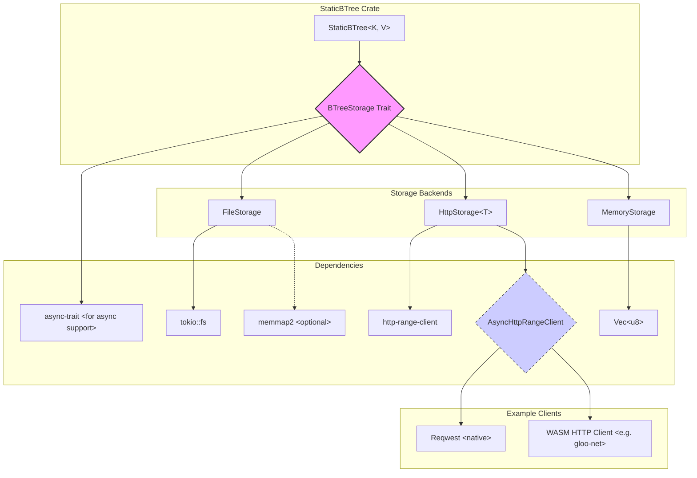

# Static B+Tree Storage Layer Implementation Plan

This document outlines the plan for implementing the storage layer for the `static-btree` crate, enabling it to work with various backends like in-memory, file system, and HTTP, ensuring cross-environment compatibility (including WASM).

## 1. Define the Storage Trait (`BTreeStorage`)

First, we define a generic trait that abstracts the storage operations needed by the static B+tree. This trait will be similar to the one in the `btree` crate but adapted for the static nature and implicit layout.

```rust
use crate::errors::Result; // Assuming errors are defined in crate::errors
use async_trait::async_trait;

/// Trait for abstracting B+tree node storage.
#[async_trait(?Send)] // ?Send might be needed depending on WASM client needs
pub trait BTreeStorage {
    /// Reads the raw byte data for a node at the given index.
    /// The index corresponds to the implicit node numbering.
    async fn read_node(&self, node_index: usize) -> Result<Vec<u8>>;

    /// Writes the raw byte data for a node at the given index.
    /// This is primarily used during tree construction.
    async fn write_node(&mut self, node_index: usize, data: &[u8]) -> Result<()>;

    /// Returns the fixed size of each node in bytes for this tree instance.
    /// This size is determined during tree construction based on branch factor and key size.
    fn node_size(&self) -> usize;

    /// Returns the total number of nodes in the storage.
    fn node_count(&self) -> usize;

    /// Flushes any buffered writes to the underlying storage.
    async fn flush(&mut self) -> Result<()>;

    // Optional: Add methods for metadata if needed (e.g., tree height, branch factor)
    // async fn read_metadata(&self) -> Result<TreeMetadata>;
    // async fn write_metadata(&mut self, metadata: &TreeMetadata) -> Result<()>;
}
```

**Key Considerations:**

* **Async:** Use `async fn` and `async-trait` for I/O operations (`read_node`, `write_node`, `flush`) to support async backends like HTTP across different runtimes.
* **`node_size`:** This is crucial. The `StaticBTree` will calculate this based on its configuration (branch factor, key size) and the storage implementation will need to know it (likely passed during initialization).
* **Error Handling:** Use the crate's `Result` type (`crate::errors::Result`).
* **Data Format:** The trait deals with raw `Vec<u8>` or `&[u8]`. Serialization/deserialization of nodes happens within the `StaticBTree` logic, not the storage layer itself.
* **`?Send`:** May be necessary on the `async_trait` depending on whether the WASM HTTP client implementation requires it.

## 2. Implement Storage Backends (Iterative TDD Approach)

We will implement the backends one by one, following Test-Driven Development (TDD).

### Step 2.1: In-Memory Storage (`MemoryStorage`)

* **Purpose:** Simplest backend, useful for testing and smaller datasets.
* **Implementation:** Use `Vec<Vec<u8>>` or a single `Vec<u8>` with slicing.
* **TDD:**
  * Write tests for `read_node`, `write_node`, `node_size`, `node_count`, `flush` (might be a no-op).
  * Implement `MemoryStorage` to pass the tests.
* **Integration:** Modify `StaticBTree` construction and query logic to accept a `BTreeStorage` trait object (e.g., `Arc<dyn BTreeStorage>`) and test with `MemoryStorage`.

### Step 2.2: File-Based Storage (`FileStorage`)

* **Purpose:** Persistent storage on the local filesystem, supporting trees larger than RAM.
* **Implementation:**
  * Use `tokio::fs` for async file operations.
  * Consider using memory-mapping (`memmap2`) for potential performance benefits, especially for reads. Need to carefully manage mutability and flushing if using `MmapMut`.
  * Store tree metadata (node size, node count, branch factor, key type info) likely in a header section of the file or a separate metadata file.
* **Dependencies:** `tokio`, `memmap2`, `serde` (for metadata), `async-trait`.
* **TDD:**
  * Write tests simulating file creation, writing nodes, reading nodes, flushing, and reopening.
  * Implement `FileStorage`.
* **Integration:** Test `StaticBTree` with `FileStorage`.

### Step 2.3: HTTP-Based Storage (`HttpStorage`)

* **Purpose:** Accessing large, static trees hosted remotely via HTTP/HTTPS, compatible with both native and WASM environments.
* **Abstraction:** Utilize the `http-range-client` crate's `AsyncHttpRangeClient` trait to abstract the underlying HTTP client.
* **Implementation:**
  * Define `HttpStorage<T: AsyncHttpRangeClient>`.
  * Internally use `AsyncBufferedHttpRangeClient<T>` for efficient range requests and buffering.
  * The specific client implementation (e.g., `reqwest`-based for native, `gloo-net`-based or other WASM-compatible client for WASM) will be provided when `HttpStorage` is instantiated.
  * Utilize HTTP Range requests (`Range: bytes=...`) to fetch only the specific bytes corresponding to a node (`node_index * node_size`).
  * Requires metadata (total node count, `node_size`) obtained separately (e.g., via headers, separate metadata endpoint, or constructor arguments).
  * This backend will primarily be read-only after construction. `write_node` and `flush` might return an error or be no-ops.
* **Dependencies:** `http-range-client`, `async-trait`, `url`.
* **TDD:**
  * Mock the `AsyncHttpRangeClient` trait for testing `HttpStorage` logic independently of actual network calls.
  * Write tests for reading nodes via the mocked client.
* **Integration:** Test `StaticBTree` with `HttpStorage` using appropriate client implementations for the target environment (native/WASM).

## 3. Caching Layer (Deferred to Phase 6)

As decided, the caching layer (`CachedStorage<S: BTreeStorage>`) using an LRU cache (`lru` crate) and prefetching strategies will be implemented *after* the core storage backends are functional and tested.

## 4. Architecture Diagram



## 5. Next Steps (Implementation Order)

1. Define `BTreeStorage` trait (with `async-trait`) in `src/rust/static-btree/src/storage.rs` (or similar).
2. Implement `MemoryStorage` and its unit tests.
3. Integrate `MemoryStorage` into `StaticBTree` (refactor constructor/methods to use the trait).
4. Implement `FileStorage` and its unit tests.
5. Test `StaticBTree` with `FileStorage`.
6. Implement `HttpStorage<T: AsyncHttpRangeClient>` and its unit tests (with trait mocking).
7. Test `StaticBTree` with `HttpStorage` using suitable client implementations.
