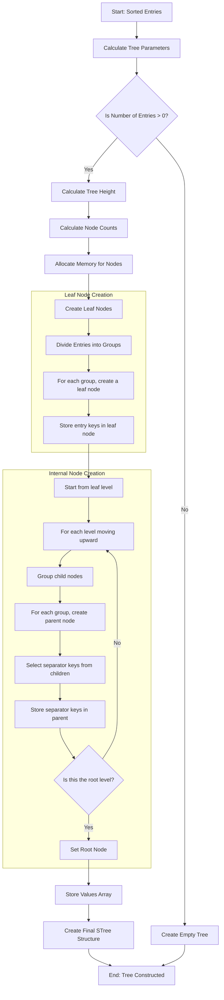
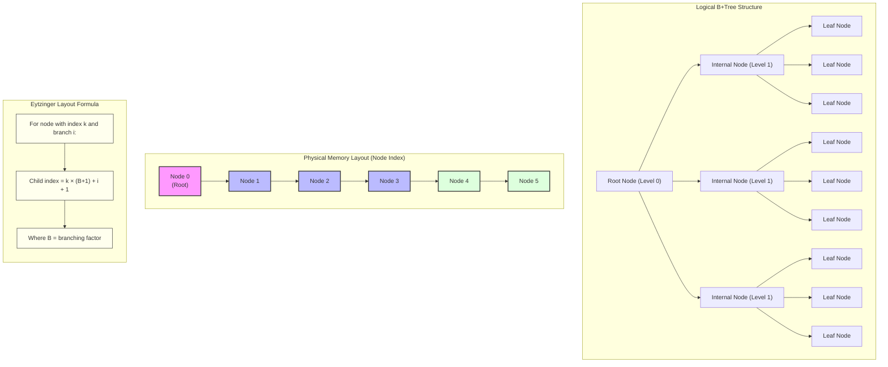
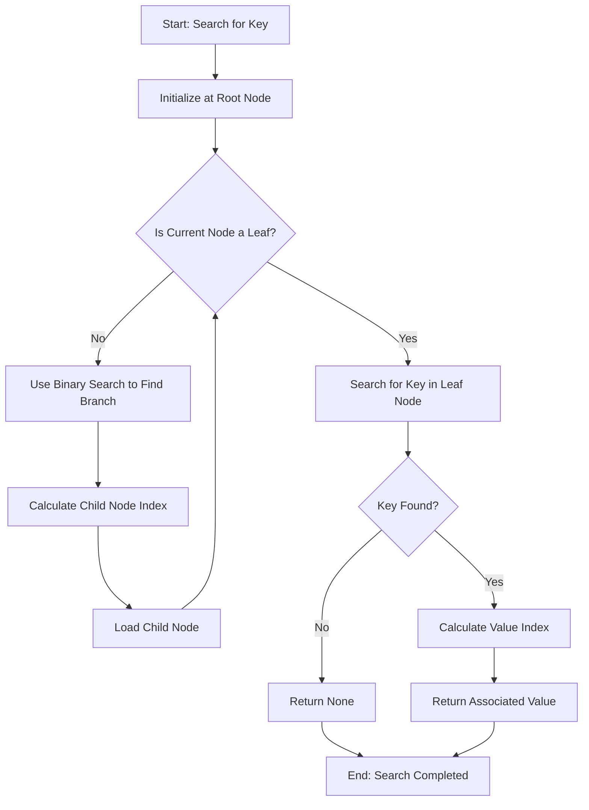
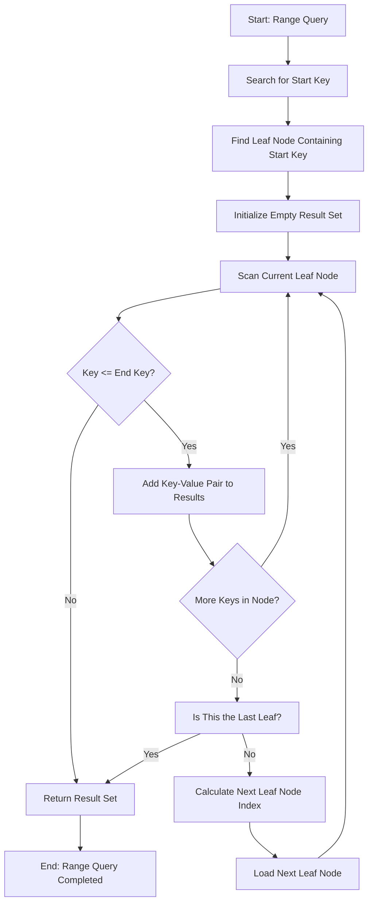
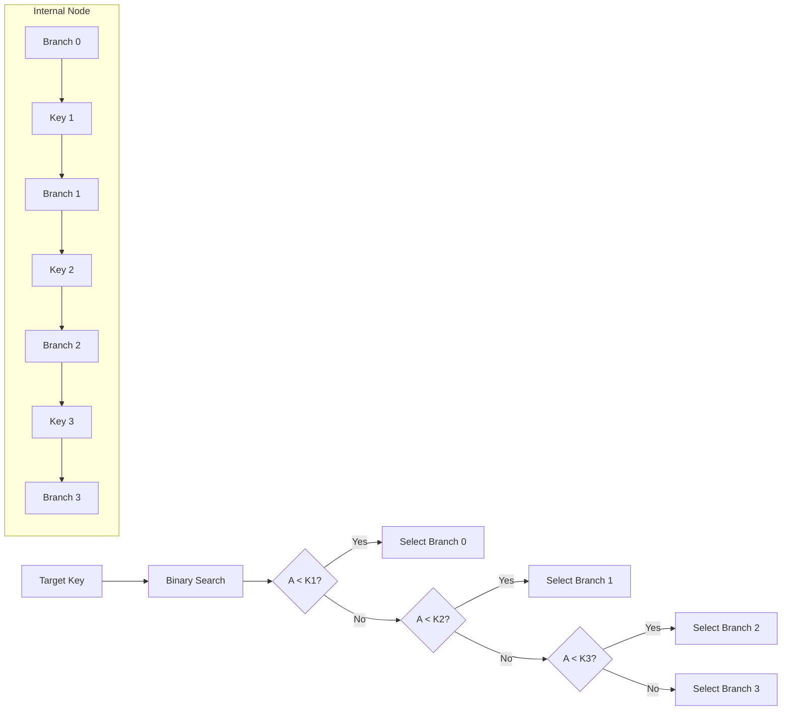

# Static B+Tree Processing Workflows

Below are Mermaid diagrams that illustrate the key workflows for the Static B+Tree implementation: construction, search, and range query operations.

## Tree Construction Workflow



## Tree Structure Visualization



## Search Operation Workflow



## Range Query Workflow



## HTTP Range Request Workflow

```mermaid
flowchart TD
    A[Start: HTTP-Based Query] --> B[Parse Query Requirements]
    B --> C[Determine Required Nodes]

    C --> D[Check Node Cache]
    D --> E{Nodes in Cache?}

    E -- All Found --> F[Return Cached Nodes]
    E -- Some/None Found --> G[Calculate Byte Ranges]

    G --> H[Optimize Byte Ranges]
    H --> I[Issue HTTP Range Requests]

    I --> J[Receive Responses]
    J --> K[Parse Node Data]

    K --> L[Update Node Cache]
    L --> M[Process Query Using Nodes]

    F --> M

    M --> N[Return Query Results]
    N --> O[End: Query Completed]

    subgraph Range Optimization
        H1[Identify Adjacent Ranges] --> H2[Merge Overlapping Ranges]
        H2 --> H3[Batch Small Ranges]
        H3 --> H4[Prioritize Cache Misses]
    end
    H -.-> Range Optimization
```

## Key Comparison During Search



These diagrams provide a visual representation of how the Static B+Tree is constructed from sorted entries and how it's used to efficiently perform search and range query operations, including the optimization for HTTP-based data retrieval.

The tree construction builds nodes in a specific memory layout that enables efficient navigation without explicit pointers. The search and range query operations leverage this structure to minimize memory accesses and optimize for cache locality.

For cloud-based applications, the HTTP workflow shows how range requests can be optimized to reduce latency when querying data stored in remote storage.
